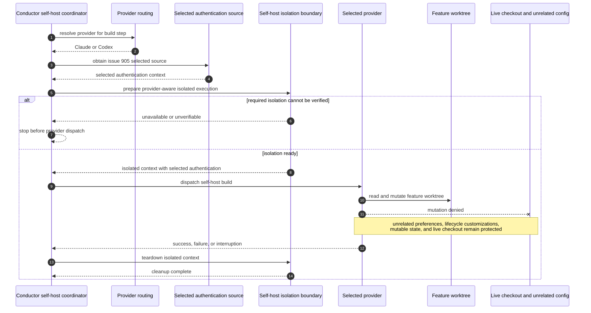

# Sequence: Provider-Neutral Self-Host Isolation (#907)

**Last updated:** 2026-07-25
**Scope:** A harness self-build under Claude or Codex, preserving issue #905's selected
authentication source while excluding unrelated operator configuration and protecting
the live checkout on every terminal path.

## Diagram

## Negative and Recovery Paths

- Isolation readiness is established before the provider runs; an unverifiable boundary
  never degrades into a normal dispatch.
- The selected authentication source is the only approved dependency on live provider
  state. Unrelated preferences, extensions, lifecycle customizations, and mutable state
  do not enter the self-host context.
- The provider may mutate the feature worktree but not the live harness checkout.
- Teardown is required after success, failure, or interruption. Retry and resume create
  a fresh isolated context with the same #905 authentication-selection rules.

## Legend

- `--x` denotes a denied mutation relationship.
- Issue #905 remains the authority for authentication selection and bounded execution;
  #907 owns the surrounding self-host configuration and checkout isolation outcome.

## Change Log

| Date | Change | Reason |
|------|--------|--------|
| 2026-07-25 | Initial sequence | DECIDE architecture for issue #907 |
