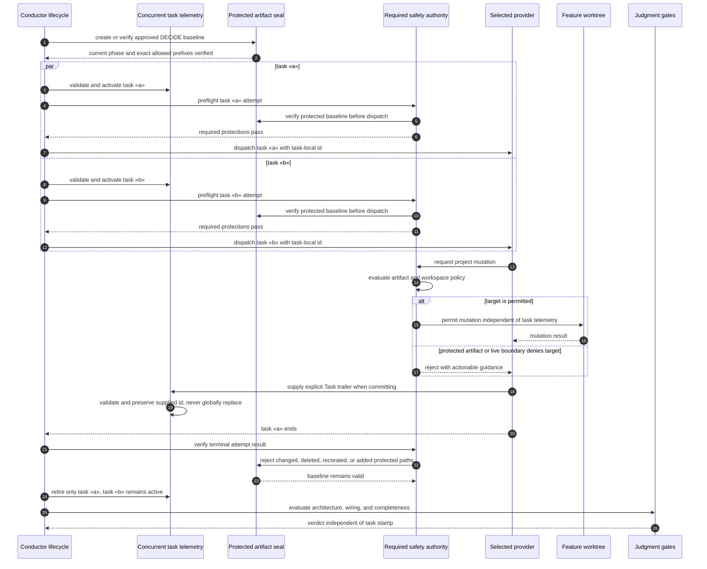

# Sequence: Provider-Neutral Task and Mutation Safety (#907)

**Last updated:** 2026-07-26
**Scope:** Concurrent task-local attribution across Claude and Codex, with mutation safety
and judgment authority independent of task telemetry.

## Diagram

## Negative and Recovery Paths

- Unknown or stale supplied ids are rejected as telemetry rather than guessed.
- Completion, failure, cancellation, and replacement retire only the matching active row.
- Retry and resume re-enter task-local validation without a workspace-global stamp.
- Initial, retry, resume, grouped, auxiliary, and provider-replacement attempts all enter
  the same pre/post safety wrapper; stale reusable state is rejected by task, provider,
  phase, workspace, baseline, and terminal-run identity.
- Missing task telemetry neither authorizes nor rejects mutation and never determines
  wiring or completion.

## Legend

- `«a»` and `«b»` are concurrent plan task identifiers.
- The selected provider may be Claude or Codex; neither owns task-state authority.
- `adr-2026-07-26-concurrent-task-telemetry-and-symmetric-self-host-isolation` keeps
  attribution advisory while artifact/workspace policies own mutation safety.

## Change Log

| Date | Change | Reason |
|------|--------|--------|
| 2026-07-26 | Add durable artifact seal and pre/post attempt safety wrapper | `/plan` update for issue #907 |
| 2026-07-26 | Replace singular task lease with concurrent task-local telemetry | Conflict-check resolution for issue #907 |
| 2026-07-25 | Resolve the task-safety authority seam | Architecture review for issue #907 |
| 2026-07-25 | Initial sequence | DECIDE architecture for issue #907 |
