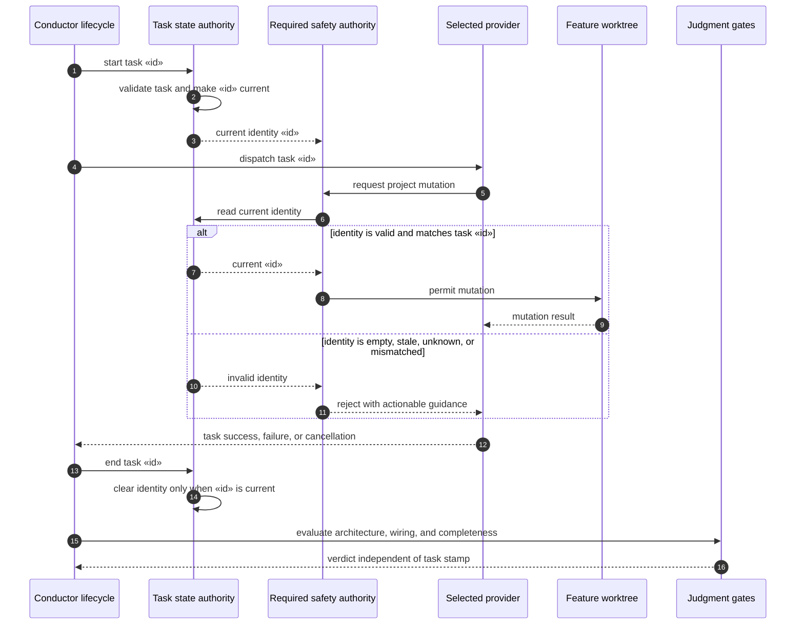

# Sequence: Provider-Neutral Task and Mutation Safety (#907)

**Last updated:** 2026-07-25
**Scope:** Current-task identity and mutation authorization across Claude and Codex,
including stale identity, failure cleanup, and the separate judgment-gate boundary.

## Diagram

## Negative and Recovery Paths

- A provider dispatch never makes an unknown or stale identity authoritative.
- Completion, failure, cancellation, and task replacement all remove the ended task's
  authority before later work proceeds.
- Retry and resume re-enter through the same start and validation flow; they do not
  inherit authority merely because an old identity remains on disk.
- The judgment gates evaluate the resulting work independently. A valid task identity
  is necessary for mutation safety but is not proof that the implementation is wired or
  complete.

## Legend

- `«id»` is the active plan task identifier.
- The selected provider may be Claude or Codex; neither owns task-state authority.
- `adr-2026-07-25-provider-neutral-safety-authority` places the task lease and
  terminal mutation audit in the conductor safety boundary; provider lifecycle hooks
  supply early events but do not own acceptance.

## Change Log

| Date | Change | Reason |
|------|--------|--------|
| 2026-07-25 | Resolve the task-safety authority seam | Architecture review for issue #907 |
| 2026-07-25 | Initial sequence | DECIDE architecture for issue #907 |
