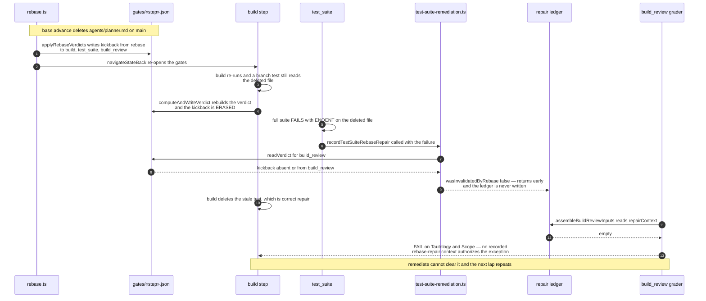
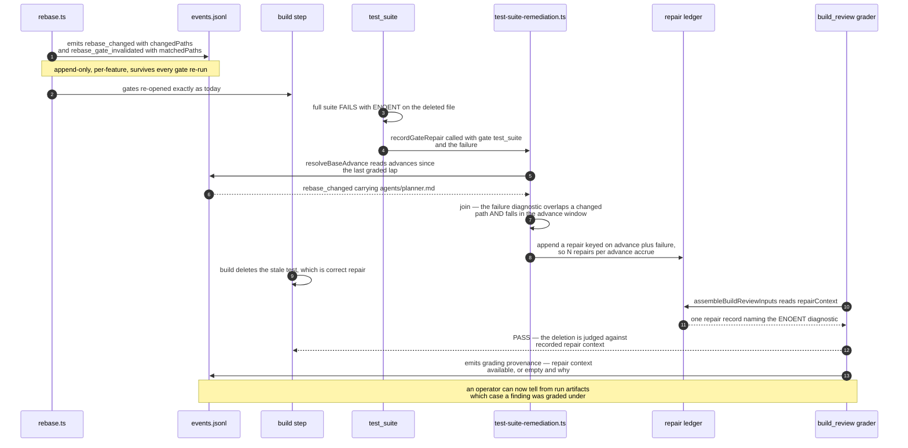

# Sequence: Base-advance repair reaches the build_review grader

**Last updated:** 2026-08-13
**Scope:** The observed failing sequence (intake #1535) and the sequence after the change.
Covers one build lap from base advance through `build_review` grading.

## Diagram: today — attribution is lost

## Diagram: after the change — attribution is durable

## Legend

- **`«slug»`** — a variable path segment (feature slug, step name).
- **events.jsonl** — `«worktree»/.pipeline/events.jsonl`, the per-feature event spine written
  by `EventPersister` into the feature's worktree. Append-only, so nothing overwrites a prior
  advance.
- **gates/«step».json** — `«worktree»/.pipeline/gates/«step».json`, a gate verdict file.
  Rewritten in full by `computeAndWriteVerdict` on every gate run, which is why it cannot carry
  a fact that must outlive one pass.
- **repair ledger** — `«worktree»/.pipeline/build-review-rebase-repairs.json`.
- **join** — an advance is matched to a failure only when the failure's diagnostic implicates a
  path the advance changed *and* the failure occurred after the advance. Path overlap is
  required. A time window alone would launder genuinely unplanned deletions.

## Change Log

| Date | Change | Reason |
|------|--------|--------|
| 2026-08-13 | Initial generation | DECIDE for intake #1535 — document the lost-attribution chain and its replacement |
