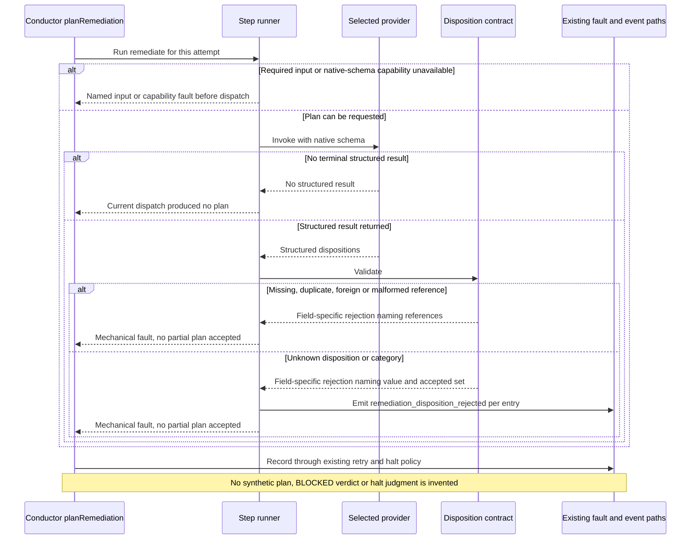

# Sequence: remediation does not produce a usable plan

**Last updated:** 2026-10-06
**Scope:** Missing result, schema-invalid output, bad references, unknown dispositions, or
unavailable required input or capability.

## Diagram

## Legend

Retry classification follows the shipped as-built and PRD-audit policy: a missing capability or
required input halts without retry; missing or invalid output follows the existing retry then
needs-human path. The exact mapping is settled in architecture review.

See the [component diagram](../remediation-dispositions-honor-the-engine-owned-in.md).

## Change Log

| Date | Change | Reason |
|------|--------|--------|
| 2026-10-06 | Initial sequence | #2522 fault boundary |
