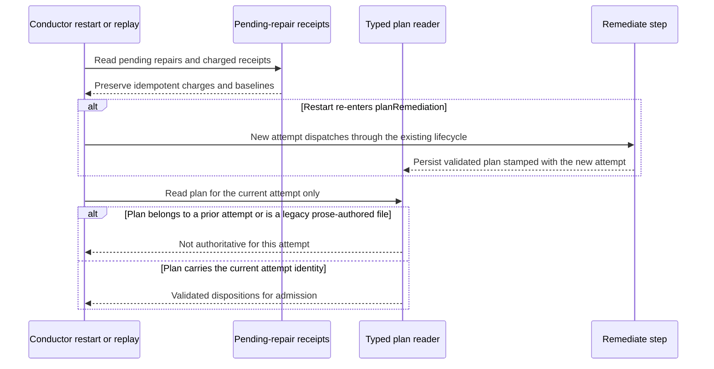

# Sequence: restart and legacy remediation plan handling

**Last updated:** 2026-10-06
**Scope:** Restart or replay of `planRemediation` across the migration.

## Diagram

## Legend

Restart keeps today's behavior: re-entering `planRemediation` is a new attempt that dispatches
again. A legacy `remediation.json` or a prior attempt's plan is never parsed into the current
plan, mirroring the as-built OD-6 precedent. Pending-repair receipts keep charges idempotent across the transition.

See the [component diagram](../remediation-dispositions-honor-the-engine-owned-in.md).

## Change Log

| Date | Change | Reason |
|------|--------|--------|
| 2026-10-06 | Initial sequence | #2522 restart boundary |
| 2026-10-06 | Restart is a new attempt; no cross-attempt reuse | Architecture review: preserve current re-dispatch behavior |
