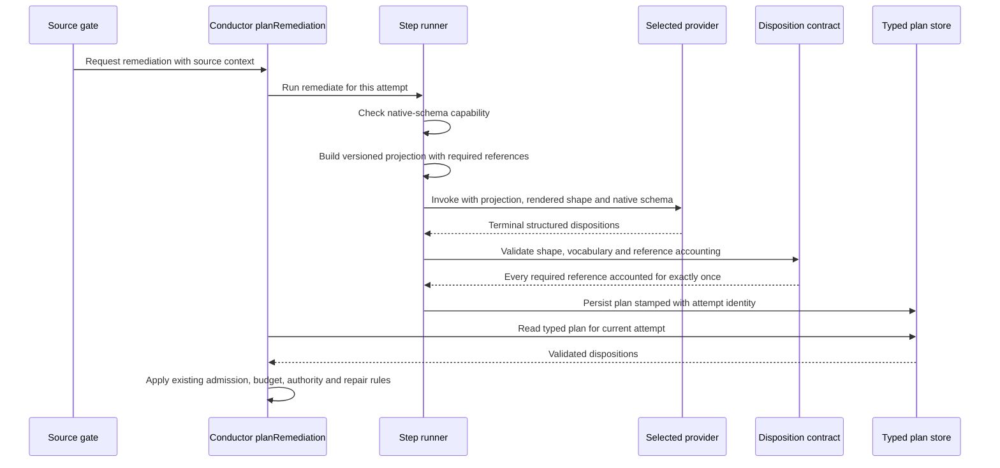

# Sequence: remediation returns a validated typed plan

**Last updated:** 2026-10-06
**Scope:** A remediation source requests a gap plan and receives validated dispositions.

## Diagram

## Legend

The provider returns judgment only. The engine renders the shape from the same schema it
validates against, so prompt and validator cannot drift.

See the [component diagram](../remediation-dispositions-honor-the-engine-owned-in.md).

## Change Log

| Date | Change | Reason |
|------|--------|--------|
| 2026-10-06 | Initial sequence | #2522 target flow |
