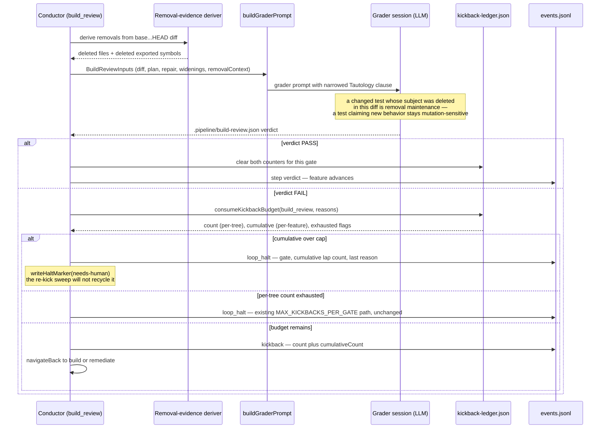

# Sequence: a non-converging build_review reaches a bounded terminal state

**Last updated:** 2026-08-12
**Scope:** One `build_review` FAIL lap, showing where the cumulative bound is consumed and where
removal evidence reaches the grader. Issue #1521.

## Diagram

## Legend

- **Two independent bounds.** `count` is keyed on the HEAD tree hash and is reset by any real
  edit — that behavior is unchanged from `adr-2026-07-26`. `cumulative` counts every lap for the
  gate regardless of tree movement, and is cleared only by a PASS. The incident escaped the first
  bound precisely because every remediation lap changed the tree; the second bound closes it.
- **`cumulativeCount` on the `kickback` event** is what makes the history readable. Today an
  operator reading `events.jsonl` sees eight rows all reporting `count 1`, which looks like eight
  unrelated first offences rather than one feature failing to converge.
- The removal-evidence step runs **before** prompt assembly and is purely deterministic — no LLM
  is in the exemption decision path, only in applying it to specific test hunks.

## Change Log

| Date | Change | Reason |
|------|--------|--------|
| 2026-08-12 | Initial generation | Issue #1521 |
