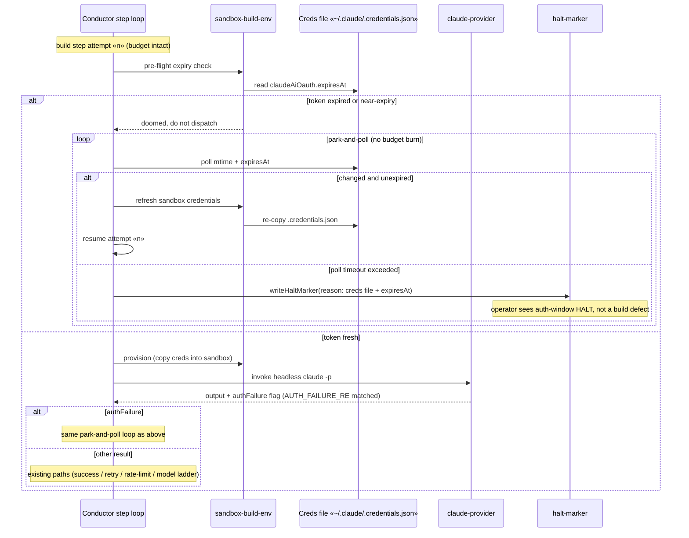

# Sequence: Sandbox auth-expiry park-and-poll

**Last updated:** 2026-07-04
**Scope:** Build-step attempt on the self-host path when the operator OAuth
token is expired at dispatch time (pre-flight catch), and when an auth failure
surfaces mid-attempt (signature catch). Both paths park without burning the
step retry budget; poll timeout ends in a credentials-specific HALT.

## Diagram

## Legend

- «n» — the attempt counter is unchanged by any park iteration; only genuine
  step failures decrement the retry budget.
- The signature catch covers tokens that are unexpired but invalid (rotated by
  a concurrent live session) — the pre-flight alone cannot see those.

## Change Log

| Date | Change | Reason |
|------|--------|--------|
| 2026-07-04 | Initial generation | DECIDE phase for sandbox-auth-expiry-park (issue #210) |
