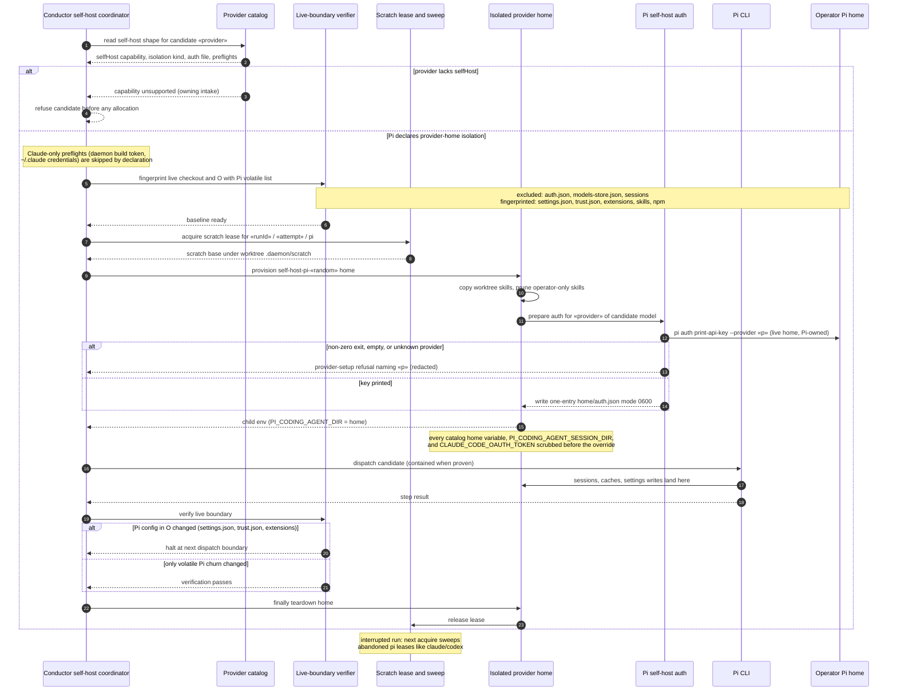

# Sequence: Pi Self-Host Isolation and Fingerprinting (#1887)

**Last updated:** 2026-10-03
**Scope:** A harness self-build dispatched through the Pi provider: catalog-declared self-host
shape selects the isolation path and preflights, Pi runs in a throwaway `PI_CODING_AGENT_DIR`
holding a single Pi-resolved credential for the dispatched provider, and the live Pi home is fingerprinted with
a Pi-specific volatile list. Extends
[provider-neutral-self-host-isolation-907](provider-neutral-self-host-isolation-907.md) to a
third provider; Claude and Codex behavior is unchanged.

## Diagram

## Negative and Recovery Paths

- A built-in provider without the `selfHost` capability is refused at the catalog before any
  fingerprint, lease, or home allocation; the refusal names the owning intake.
- Isolation kind, selected auth file, and Claude-only preflights come from the catalog
  descriptor, not from provider-id comparisons in `conductor.ts`, so Pi never reaches the daemon
  build-token or `~/.claude` credential preflights.
- The live `auth.json` is never copied or symlinked. A whole-file copy would hand the build every
  other provider's credential (adr-2026-07-26 §3). A link would race the operator's interactive Pi,
  because Pi rewrites the file in place under a lock keyed to the link path.
- The credential is resolved by Pi (`pi auth print-api-key`), so `!command` values and OAuth
  refresh stay Pi-owned in the live home, and no refresh token rotates inside a copy.
- A provider Pi cannot resolve fails provisioning before dispatch, with a redacted diagnostic, and
  the scratch lease is released. This includes providers registered by extensions or packages.
- Live `auth.json` is excluded from the fingerprint as the selected auth path (Codex parity), so
  an operator-side OAuth refresh does not halt a run.
- Operator edits to fingerprinted Pi config halt the run whether or not the dispatch is contained.
  Proven containment relaxes only the live-checkout surface.
- Containment remains `--dev-bind / /` with the live checkout read-only; the build can still read
  the operator home. Hiding it is out of scope.

## Legend

- `«provider»`, `«runId»`, `«attempt»`, `«random»` are placeholders.
- "Volatile list" entries are root-level paths excluded from the provider-state fingerprint.

## Change Log

| Date | Change | Reason |
|------|--------|--------|
| 2026-10-03 | Pi-resolved single credential replaces opaque copy | Architecture review found adr-2026-07-26 §3 conflict |
| 2026-10-03 | Initial sequence | DECIDE architecture for issue #1887 |
