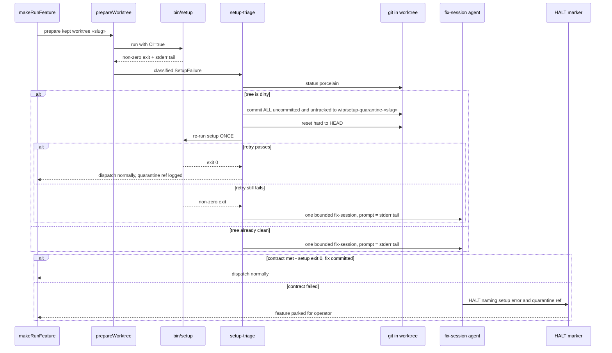

# Sequence: Setup-failure triage (#446)

**Last updated:** 2026-07-09
**Scope:** The two triage stages that run when `bin/setup` fails in a daemon worktree,
from re-dispatch of a kept broken tree through quarantine, retry, fix-session, and the
HALT terminal.

## Diagram

## Legend

- Stage 1 (quarantine + single retry) is deterministic git machinery; stage 2 (fix-session)
  is the single LLM dispatch, one attempt per rotation.
- The quarantine commit is created BEFORE any reset — preserve-then-heal, never
  silently discard.
- «slug» is the feature slug of the wedged worktree.

## Change Log

| Date | Change | Reason |
|------|--------|--------|
| 2026-07-09 | Initial generation | DECIDE phase for issue jstoup111/ai-conductor#446 |
