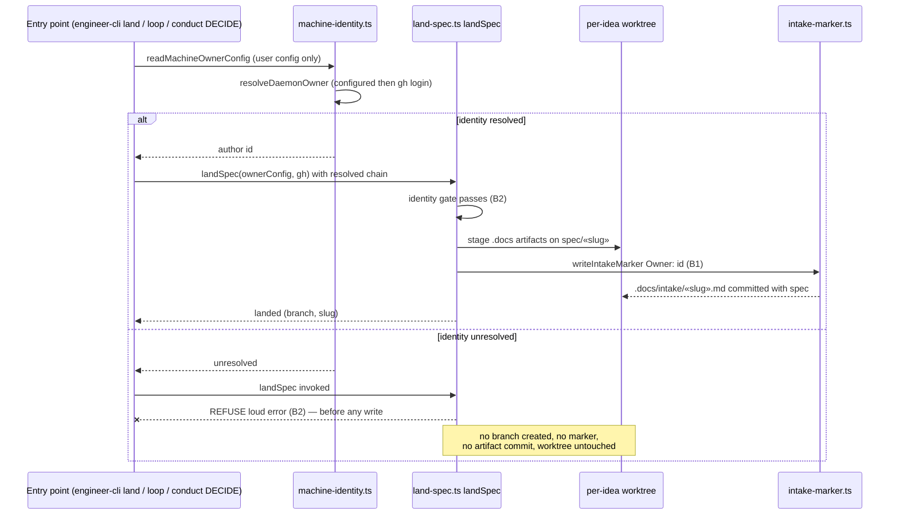

# Sequence: Slice B fail-closed land (B2) + universal stamping (B1)

**Last updated:** 2026-07-02
**Scope:** The land flow through `landSpec` after Slice B — identity resolved from the
machine (user-config) chain, gate evaluated before any write, both outcomes shown.

## Diagram

## Legend

- The gate fires inside `landSpec` **before** branch creation / staging / marker write —
  the refusal path leaves the target repo byte-for-byte unchanged.
- `machine-identity.ts` reads the **user** config only; the target repo's project config
  is never part of the identity chain (D2 anti-leak, enforced since Slice A).
- B1: the plain `/conduct` DECIDE path gains the same `writeIntakeMarker` stamping the
  `/engineer` path already has.

## Change Log

| Date | Change | Reason |
|------|--------|--------|
| 2026-07-02 | Initial generation | Slice B spec (issue #184) |
