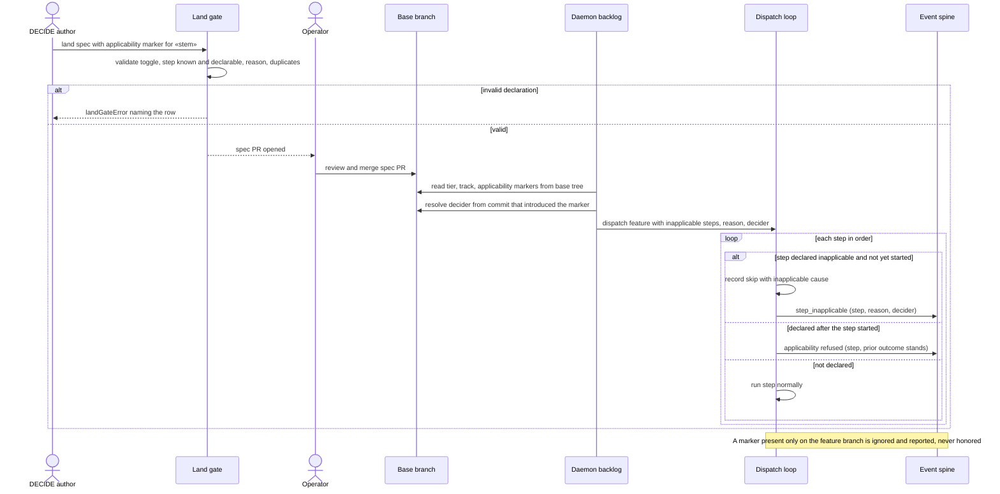

# Sequence: per-feature inapplicable step, declare → merge → dispatch

**Last updated:** 2026-10-03
**Scope:** One feature in a repository with the per-feature applicability toggle on, from DECIDE
declaring a step inapplicable to the daemon dispatching past it, plus the branch-only and late
declaration refusal paths.

## Diagram

## Legend

- `«stem»` is the feature's plan stem.
- Event names are proposals; architecture-review fixes the final schema on the existing
  ConductorEvent union.

## Change Log

| Date | Change | Reason |
|------|--------|--------|
| 2026-10-03 | Initial generation | #1789 per-feature step applicability DECIDE |
