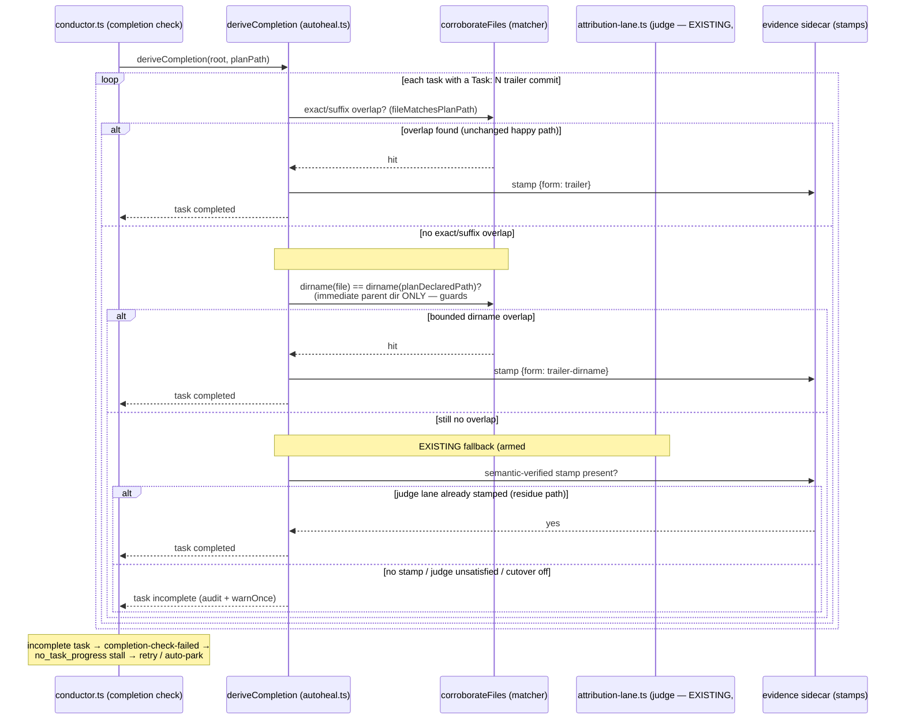

# Sequence: Task Completion Corroboration (deriveCompletion) — #707

**Last updated:** 2026-07-20
**Scope:** How `deriveCompletion` in `src/conductor/src/engine/autoheal.ts` credits (or
rejects) a task from the commit that carries its `Task: N` trailer. #707 adds exactly ONE
new stage: a **bounded deterministic dirname/subsystem overlap pass** (marked NEW below).
The semantic attribution-judge fallback shown here already exists and is armed
(`attribution_judge_cutover`); its resume-dispatch gap was closed by PR #700 — #707 does
**not** modify it, and it is drawn only to show where the new deterministic pass sits
relative to it.

## Diagram

## Legend

- **corroborateFiles / matcher** — `filesOverlappingTaskPaths` + `fileMatchesPlanPath`.
  Today: `f === p` or `f.endsWith('/' + p)`. **#707 adds the bounded dirname branch only.**
- **Bounded dirname match (#707):** a commit file corroborates iff its immediate parent
  directory equals the immediate parent directory of a plan-declared path. NOT any ancestor,
  NOT repo-root — this bound is what keeps #445's "same as Task N" inheritance closed.
- **stamp forms** — `trailer` (exact/suffix), `trailer-dirname` (new #707 deterministic),
  `semantic-verified` (existing judge lane). Persisted in the evidence sidecar so later gate
  runs and `task-status.json` rows agree.
- **Judge lane (EXISTING):** `runAttributionLane`, gated by `attribution_judge_cutover`;
  dispatches on residue (incl. inherited/resumed residue since #700) with a same-attempt
  re-derive at conductor.ts:3326. #707 does not touch it.
- **Reject path** — unchanged sink: audit entry + `warnOnce` "Path corroboration failed",
  task stays incomplete → `no_task_progress`.

## Change Log

| Date | Change | Reason |
|------|--------|--------|
| 2026-07-20 | Initial creation | #707 — document the corroboration decision flow |
| 2026-07-20 | Re-scoped to bounded dirname pass only | DECIDE correction: judge fallback already exists/armed and #700 closed its resume-dispatch gap; #707 adds only the deterministic dirname stage, bounded to guard #445 |
