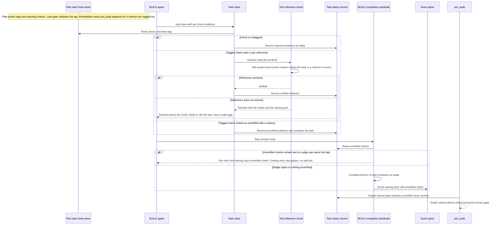

# Sequence: A test-tagged Done-when check is verified at task close

**Last updated:** 2026-10-02
**Scope:** How a Done-when check the plan tags as test-requiring is evidenced at BUILD task close, how an unverified check is nudged once inside BUILD, and how a still-unverified check is recorded and supplied to `prd_audit`. Untagged checks and legacy plans are unchanged.

## Diagram

## Legend

A test reference is a file path plus a test title. It is verified by text only: the file exists at HEAD, the whitespace-normalized title occurs in it, and a `Covers:` marker in the file names the task (`task:«id»`) or a story criterion that the check covers. No language, framework, or repository-specific parsing is involved, so consumer projects get the same check. The file need not be in the feature diff, so a check that relies on an existing test still verifies. Unverified checks never stall BUILD on `no_task_progress`: their tasks are completed. Exhausting existing retry or lap caps halts exactly as today; nothing here adds a halt class.

## Change Log

| Date | Change | Reason |
| --- | --- | --- |
| 2026-10-02 | Dropped the testQuality-rubric fallback; still-unverified checks go to the event spine and prd_audit input | Operator chose option 1; rubric route is a follow-up intake |
| 2026-10-02 | Initial sequence | #2758: tasks closed on boilerplate Done-when evidence; missing tests surfaced only as prd_audit laps |
