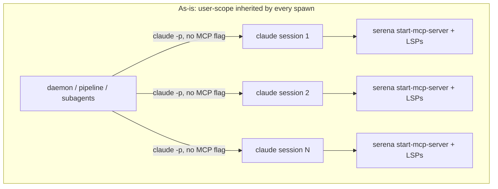
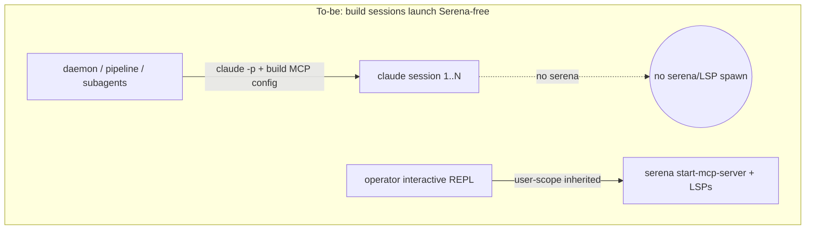
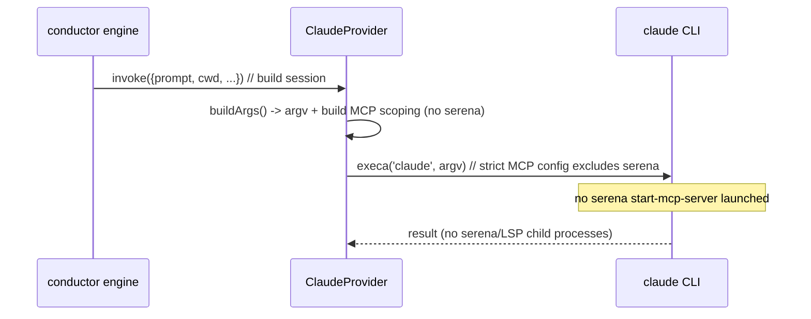

# Architecture: bounding Serena/MCP fan-out (serena-mcp-fanout)

Scope: internal change to how the conductor spawns `claude` build sessions. One component
view + one sequence view — the only architecturally interesting seam is the MCP-config
injection at the single spawn point.

## Problem (as-is)

Serena is registered **user scope** in `bootstrap/SKILL.md` §9a. `ClaudeProvider.buildArgs()`
(`src/conductor/src/execution/claude-provider.ts`) builds the `claude` argv for every
harness-spawned session and passes **no** MCP-scoping flag. Every spawned session therefore
inherits the user-scoped Serena and launches its own stdio `serena start-mcp-server` +
per-project language servers. The daemon, parallel worktree branches, and subagents run many
such sessions concurrently, so process count grows ~linearly with session count.

## Target (to-be, Approach A)

`buildArgs()` injects an MCP-scoping flag for **build** sessions (the `invoke` print path and
the non-interactive `invokeInteractive` print path) that excludes Serena, while leaving the
operator's **interactive** REPL sessions (`invokeInteractive` with `interactive: true`) and
the operator's own top-level `claude` sessions untouched. Build sessions launch with no Serena
server; interactive operator sessions keep the full user-scoped Serena.

## Component view

- **`ClaudeProvider.buildArgs`** — sole spawn point; gains conditional MCP-scoping argv for
  build sessions. This is the single deterministic enforcement site (repo Design Principle).
- **Build-session MCP config source** — how the Serena-less config is produced. The
  config-scoping decision (strip only Serena vs. minimal/empty MCP set for build sessions, and
  whether other user MCP servers such as GitHub are preserved) is fixed by the ADR from
  `/architecture-review`. buildArgs consumes whatever that decision selects.
- **`bootstrap/SKILL.md` §9a** — registration guidance; updated to reflect that user-scope
  Serena is intentionally interactive-only and that build sessions are launched Serena-free by
  the conductor (no operator action required).
- **`removeWorktree` (optional, if C folded in)** — teardown reaping of any orphaned
  serena/LSP processes; out of scope unless the plan adopts the light C complement.

## Sequence: a build session spawn

## Non-goals
- Not changing Serena's own internals or LSP backend.
- Not introducing a long-lived shared Serena server (Approach B, rejected).
- Not disabling Serena for the operator's interactive sessions.
