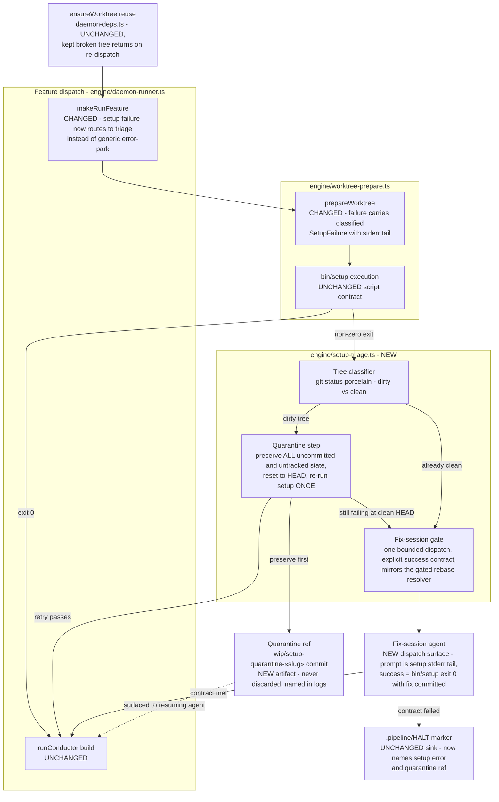

# Components: Setup-failure triage at the worktree-prepare seam (#446)

**Last updated:** 2026-07-09
**Scope:** Components touched by the setup-before-dispatch wedge fix — deterministic
quarantine of uncommitted breakage plus one bounded fix-session for committed breakage,
inserted where `bin/setup` failure currently hard-errors the feature.

## Diagram

## Legend

- **NEW** nodes are introduced by this feature; **CHANGED** nodes are modified; **UNCHANGED**
  nodes are load-bearing context.
- Solid arrows: control flow. Dotted arrow: information surfaced, not control.
- Stage 1 (classifier + quarantine) is pure machinery — no LLM. Stage 2 (fix-session) is the
  one LLM dispatch, bounded to a single attempt per rotation, following the gated `/rebase`
  resolver shape.
- Preserve-then-heal discipline mirrors `leak-triage.ts` (#380/#435): nothing is deleted or
  reset before it is preserved and named.
- Invariant delivered: `bin/setup` exit 0 ⇒ byte-for-byte the pre-fix dispatch path (zero
  happy-path change). A feature can no longer loop error→rekick→error on the same tree state.

## Change Log

| Date | Change | Reason |
|------|--------|--------|
| 2026-07-09 | Initial generation | DECIDE phase for issue jstoup111/ai-conductor#446 |
