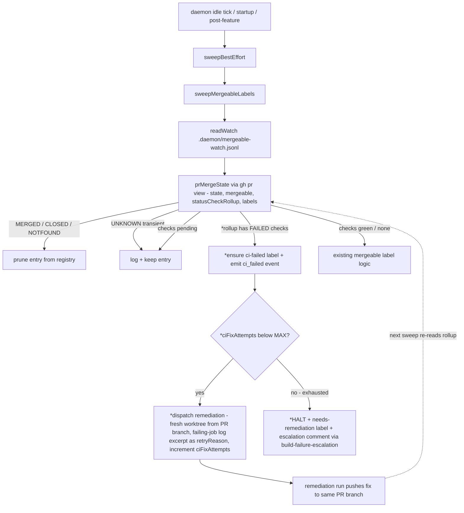
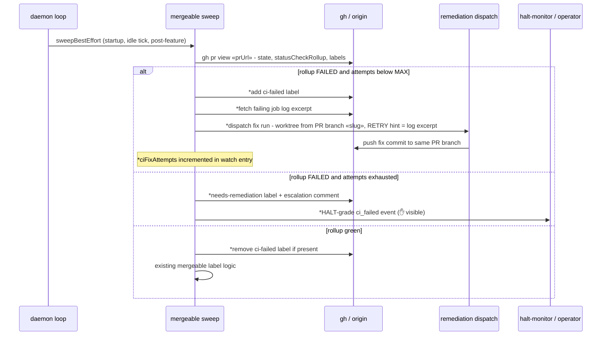

# Architecture: ship→CI feedback loop + fixture-portability guards (ai-conductor#397)

Mergeable sweep after this change. New elements marked with `*`. The sweep already fetches
`statusCheckRollup` per watched PR (`prMergeState`, pr-labels.ts) — today it only gates the
`mergeable` label. This change adds a CI-failure branch that dispatches bounded remediation,
mirroring the existing Task-17 conflict-autoresolve seam.

Bounding state lives in the watch entry itself (`ciFixAttempts`, like the existing
`resolveAttempts`), so a permanently-red PR converges to a human HALT instead of looping.
The `ci-failed` label is removed when a later sweep sees the rollup green again.

## Fixture-portability guards (second deliverable)

Structural meta-test (new file under `src/conductor/test/structural/`), same conventions as
`non-autonomy.test.ts` (falsifiability tests + comment-marker escape hatch), but **glob-based
over `src/conductor/test/**`** rather than import-graph:

| Guard | Pattern flagged | Escape hatch |
|-------|-----------------|--------------|
| Branch portability | `git init` without `-b «branch»` (and not `--bare`), across all exec wrapper shapes | `// portability-ok: «reason»` |
| Timer lifecycle | `.unref()` on timers in `src/engine` loop paths | annotation comment |
| Atomic writes | tmp-file staged outside target dir then rename/copy | annotation comment |

No runtime coupling to the sweep — pure test-time guard; the ~16 existing non-portable
`git init` call sites are fixed in the same change so the guard lands green.

## Legend

- `*` — new element introduced by this feature
- `«…»` — variable placeholder (slug, branch, PR URL)
- Watch registry — `.daemon/mergeable-watch.jsonl`, one JSON object per line per shipped PR

## Change Log

| Date | Change | Reason |
|------|--------|--------|
| 2026-07-07 | Initial generation | Spec for #397 ship→CI feedback loop (engineer DECIDE) |
