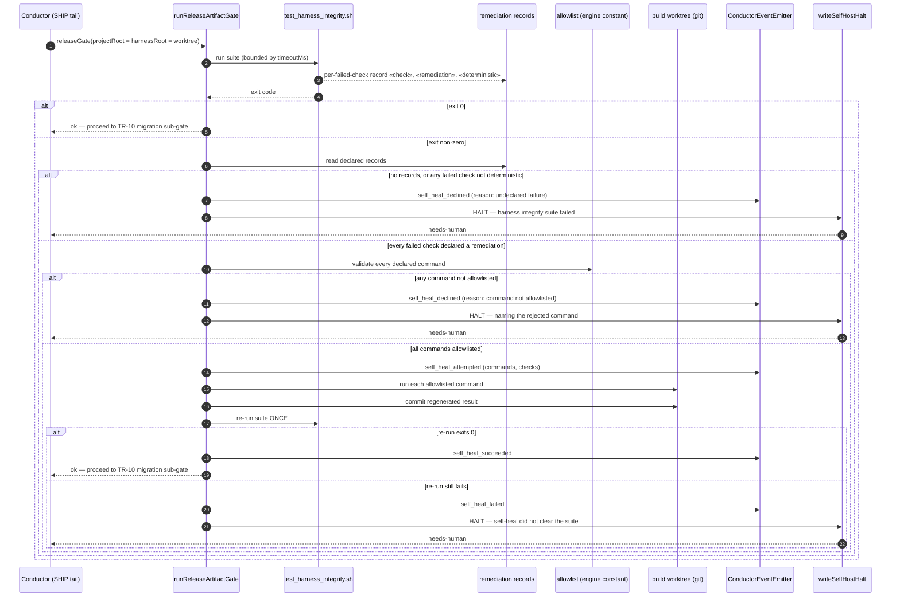

# Architecture: Bounded mechanical-remediation lane in the self-host release gate

**Last updated:** 2026-09-06
**Scope:** The self-host release gate's integrity sub-gate (TR-8) and the new bounded
self-heal path between it and the terminal HALT. Covers issue #658.

## Diagram

## Legend

- **remediation records** — machine-readable per-failure output emitted by
  `test/test_harness_integrity.sh` alongside its existing human-readable `FAIL` lines. Each
  record names the check, the remediation command, and whether that command is deterministic
  and side-effect-free.
- **allowlist** — a reviewed engine-side constant enumerating the commands the gate is
  permitted to execute. The suite declares intent; only the engine decides what may run. This
  is the trust boundary: the suite is content from the diff under review, the allowlist is not.
- **bounded** — exactly one self-heal attempt per gate run. A failed re-run HALTs; it never
  loops. This mirrors the bounded mechanical-fault allowance already used by `build_review`.
- **worktree** — on a self-host build `projectRoot`, `harnessRoot`, and the git repository the
  gate commits into are all the feature worktree, which the live boundary excludes. The gate
  never writes to the live root checkout.
- **fail-closed** — every branch that cannot prove the failure is mechanically remediable
  reaches the existing terminal HALT unchanged. The lane only ever converts a HALT into a
  pass, never a failure into a silent skip.

## Change Log

| Date | Change | Reason |
|------|--------|--------|
| 2026-09-06 | Initial generation | Feature design for #658 — self-heal or route mechanical release-gate remediation instead of terminally halting |
