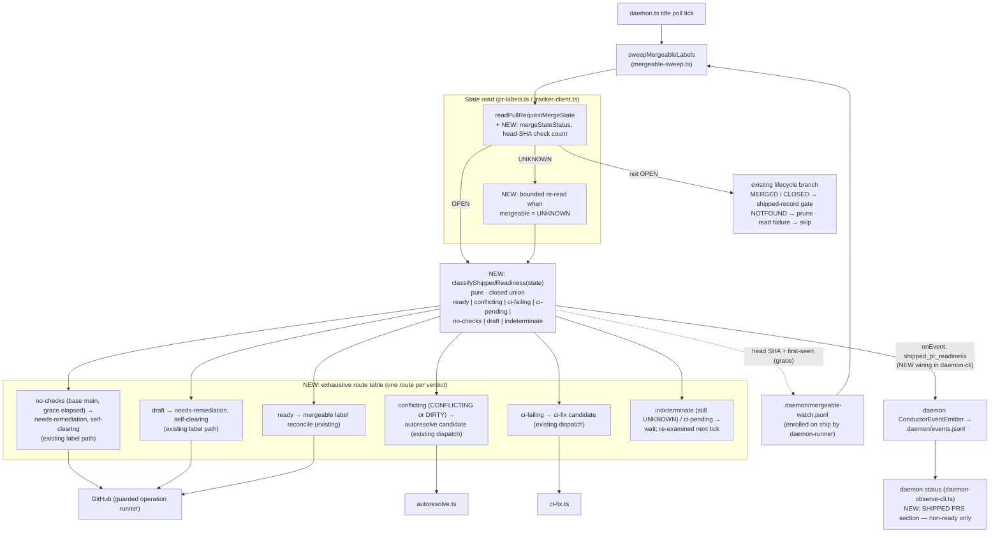
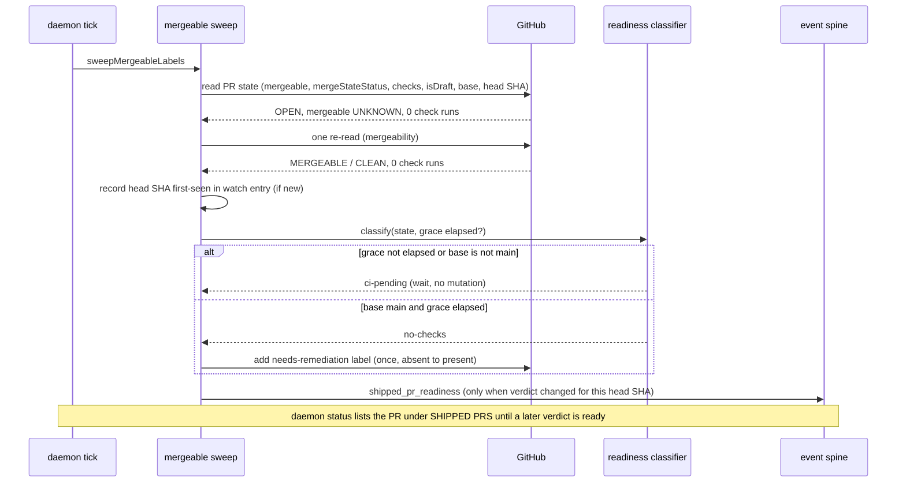

# Architecture — Shipped PRs get a re-examined readiness verdict

**Stem:** `shipped-is-fire-and-forget-no-reconciliation-sweep` · Tier M (lightweight) · 2026-10-09 · Refs #438

**Last updated:** 2026-10-09
**Scope:** the daemon's per-tick mergeable sweep over **daemon-shipped, watched PRs only**
(`.daemon/mergeable-watch.jsonl` entries enrolled by `daemon-runner.ts` on ship). Spec PRs,
manual/unledgered PRs, and any operator digest of them are out of scope.

Today `sweepMergeableLabels` (`mergeable-sweep.ts`) reads each watched PR once and runs a chain
of independent `if`s: prune MERGED/CLOSED, skip read failures, reconcile the `mergeable` label,
collect `mergeable === 'CONFLICTING'` (non-draft) for autoresolve, collect `checksOutcome ===
'failed'` for ci-fix. Three states fall through every branch: lazy `UNKNOWN` mergeability
(GitHub computes it on demand — a second read resolves it), a head SHA with **zero** check runs
(`checksOutcome: 'none'` is treated as no evidence), and a shipped PR that drifted back to
**draft** after finish marked it ready.

The change: after the existing MERGED/CLOSED/NOTFOUND lifecycle handling, each **live** watched
PR gets exactly one **readiness verdict** from a pure classifier, and each verdict has exactly
one route. The route table is an exhaustive `switch` over a closed union, so adding a verdict
without a route is a compile error. Every verdict is emitted on the existing event spine; the
status renderer reads the latest verdict per PR from `.daemon/events.jsonl` (same pattern as the
READ-ONLY REVIEW CAPABILITY section).

## Component / dataflow (C4 component level)

## Sequence — one tick for a zero-check, lazily-UNKNOWN shipped PR

## Legend

- **NEW** marks components this feature adds; everything else exists on main today.
- `conflicting` covers `mergeable = CONFLICTING` **or** `mergeStateStatus = DIRTY`.
- `indeterminate` and `ci-pending` are the only verdicts whose route performs no action; it is re-examined on the
  next tick, never silently dropped (it is still emitted and still shown in status).
- **Self-clearing:** a `needs-remediation` label the sweep added for `no-checks`/`draft` (recorded as
  `escalationCause: shipped-readiness`) is removed once the verdict is none of `no-checks`,
  `draft`, `ci-pending`, `indeterminate`; labels
  from any other source stay sticky.
- Existing draft exclusion for autoresolve/ci-fix dispatch is preserved: a `draft` verdict routes
  only to the needs-remediation signal.

## Change Log

| Date | Change | Reason |
|------|--------|--------|
| 2026-10-09 | Initial generation | Spec for #438 (Approach B, operator-confirmed scope: daemon-shipped PRs) |
| 2026-10-09 | no-checks routes to needs-remediation (no CI nudge); added ci-pending; sweep onEvent wired to daemon emitter | Operator chose surface-only nudge; review found sweep events unwired |
| 2026-10-09 | Readiness label is self-clearing (escalationCause shipped-readiness) | Conflict-check: sticky label barred recovered PRs from mergeable and ci-fix |
| 2026-10-09 | Plan update: readiness label held through ci-pending; status restricted to watched PRs | /plan independent judgements |
