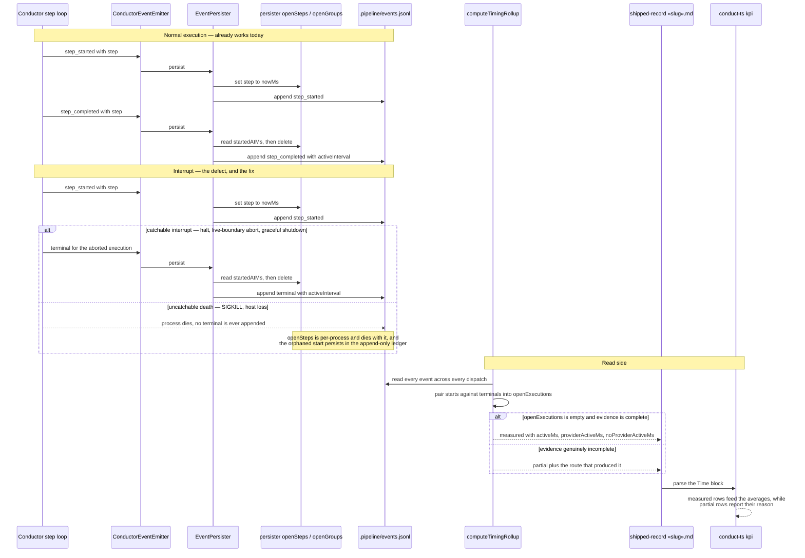

# Sequence: An interrupted execution still closes, and a genuine partial says why

**Last updated:** 2026-08-12
**Scope:** Terminal-event completeness on interrupt paths, the persister's per-process open-interval
map as the `activeInterval` source, and the degrade reason carried from `calculateTimingRollup`
through the shipped record's `## Time` block into `conduct-ts kpi`.

## Diagram

## Legend

- **`activeInterval` is stamped by the persister, not by the emitter.** `event-persister.ts:95-100`
  computes it at persist time from `openSteps` / `openGroups`, keyed by step name, and only for
  `step_completed`, `step_failed`, `parallel_completed`, `parallel_failure`. The terminal event is
  therefore the sole carrier of an execution's active time — which is why an execution that never
  emits a terminal loses its duration outright, not merely its close marker.
- **The open map is per-process; the ledger is per-worktree and append-only.** A start written by
  one dispatch and a terminal written by the next cannot be paired by the persister, because the new
  process begins with an empty map. Only `computeTimingRollup`, reading the whole ledger, sees both.
- **Two interrupt classes, two honest answers.** A catchable interrupt can emit its terminal while
  the process still holds `openSteps`, so its `activeInterval` is real and the rollup can reach
  `measured`. An uncatchable death cannot, and its active time is unrecoverable — the rollup must
  stay `partial` rather than close the execution reader-side and report a total that silently
  undercounts.
- **The reason travels with the value it qualifies.** `calculateTimingRollup` has five distinct
  routes to `partial` (`timing-rollup.ts:143-147`, `:157-162`, `:172`); the committed record today
  records none of them. The reason is carried as an additional field of the existing `## Time` block
  — durable state qualifying `state:`, read by name by `kpi-report`'s parser — not as a second
  telemetry channel.
- **Measured against live ledgers on 2026-08-12:** five of six worktrees returned `partial`, every
  one of them via `openExecutions.size > 0`; the sixth, with no open executions, returned a complete
  `measured` result. The arithmetic was never the defect.

## Change Log

| Date | Change | Reason |
|------|--------|--------|
| 2026-08-12 | Initial generation | DECIDE for #1260 — shipped-record timing never reaches `measured` |
