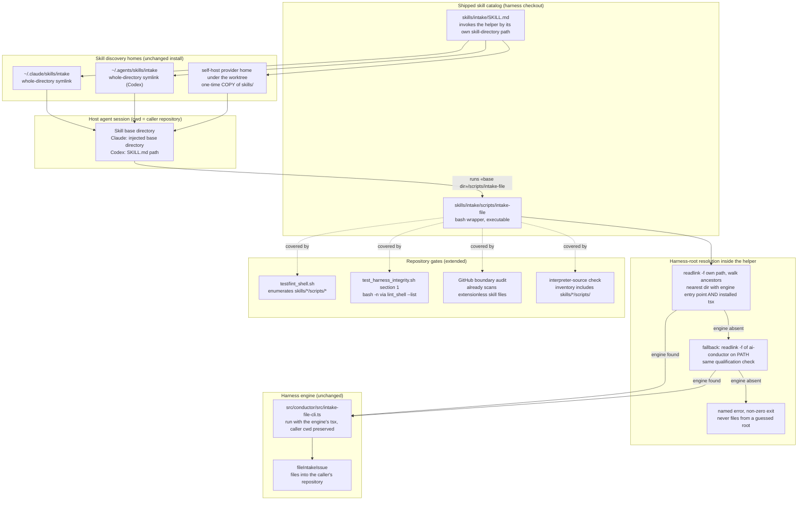

# Components: Skills may bundle executable helpers

**Last updated:** 2026-09-28
**Scope:** Where a shipped skill's executable helper lives, how the skill invokes it from any repository, how the helper locates the harness engine (installed, sandboxed, and self-host provider-home layouts), and which repository gates cover bundled helpers (issue #742). First case: `intake-file`.

## Diagram

## Responsibilities and boundaries

- **The skill owns its helper's path.** SKILL.md never names a path relative to the working
  directory; it names the helper relative to the skill directory the host reports, so the same text
  works from the harness checkout and from a consumer repository.
- **The helper owns engine location, not filing logic.** It is a thin wrapper: resolve the harness
  root, then exec the existing TypeScript CLI. All filing behaviour stays in `fileIntakeIssue`,
  inside existing tsc, ESLint, and Vitest coverage.
- **The caller's working directory is preserved.** The helper does not `cd` into the engine tree, so
  a filing without `--repo` targets the repository the operator is working in.
- **Install is unchanged.** Whole-directory symlinks already carry every file in a skill directory to
  both discovery homes; no `bin/install`, PATH, or `--check` change is made.
- **Self-host copies are expected.** The provider home copies `skills/` into scratch under the
  feature worktree, so the ancestor walk reaches the worktree (or, without installed dependencies, the
  root checkout above it). The `PATH` fallback covers copies not beneath a checkout, and a missing
  engine is a named failure rather than a guess.

## Legend

- Solid arrows: runtime invocation or resolution flow.
- Dotted arrows: validation coverage by repository gates.
- «base dir»: the skill directory path the host reports for the loaded skill.

## Change Log

| Date | Change | Reason |
|------|--------|--------|
| 2026-09-28 | Initial generation | Issue #742: skills may bundle executable helpers |
