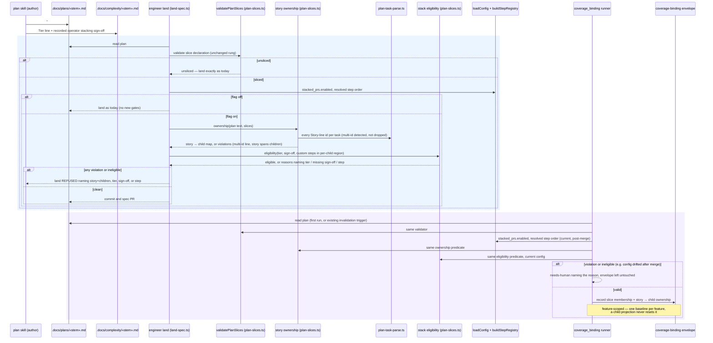

# Sequence: Sliced plans — story ownership and stack eligibility at land and build entry

**Last updated:** 2026-10-07
**Scope:** How a sliced plan's stories are bound to exactly one child (#2941), the single
stack-eligibility verdict (tier, DECIDE sign-off, `stacked_prs.enabled`, custom-step placement),
the two points that evaluate both (engineer land and `coverage_binding`), and the feature-scope
contract `coverage_binding` keeps for the per-child BUILD region (#2940 ticket 3). The per-child
BUILD region itself, restack, leaf gates and publication are out of scope.

## Diagram

## Legend

- **Story ownership** and **stack eligibility** are new pure predicates beside
  `validatePlanSlices` in `plan-slices.ts`. Land and `coverage_binding` call the same functions on
  the same inputs, so they can never disagree (the #1744 shared-predicate precedent, as in
  `adr-2026-09-29-plan-slice-manifest`).
- **`plan-task-parse.ts`** stays the Story-line grammar owner. It gains a form that reports every
  id on a `**Story:**` line, so a comma list is detected instead of silently keeping the first id.
  The existing single-id parser keeps its behavior for unsliced plans.
- **Ownership** is derived, not declared: a story is owned by the child whose tasks cite it. Tasks
  that cite no story (infrastructure) belong to no story and may sit in any child.
- **Eligibility** takes the complexity tier (must be M or L), the recorded DECIDE sign-off in the
  complexity artifact, `stacked_prs.enabled`, and the resolved step order. A custom step resolved
  inside the per-child region (`acceptance_specs` through `build_review`) makes the plan
  ineligible, naming the step. Custom DECIDE steps and steps after the region are ignored.
- The **blue band** is land. The existing `plan-slices` rung is unchanged; the new checks run only
  when the plan is sliced **and** the flag is on, so unsliced and flag-off plans land as today.
- The **purple band** is build entry. Because land ran under whatever config existed at land
  time, `coverage_binding` re-evaluates both predicates under the current config. A flag turned on
  after merge, or a custom step moved into the region, fails closed there rather than building an
  ineligible stack.
- **Feature-scope contract:** `coverage_binding` holds one whole-feature baseline. It runs before
  the first child and re-runs only on its existing invalidation triggers; a child projection
  (ticket 3) reads the recorded ownership and never resets the baseline.

## Change Log

| Date | Change | Reason |
|------|--------|--------|
| 2026-10-07 | Initial generation | DECIDE for #2941 (approach C) |
| 2026-10-07 | One config loader at both points; refusal leaves the envelope untouched | Adversarial spec review |
