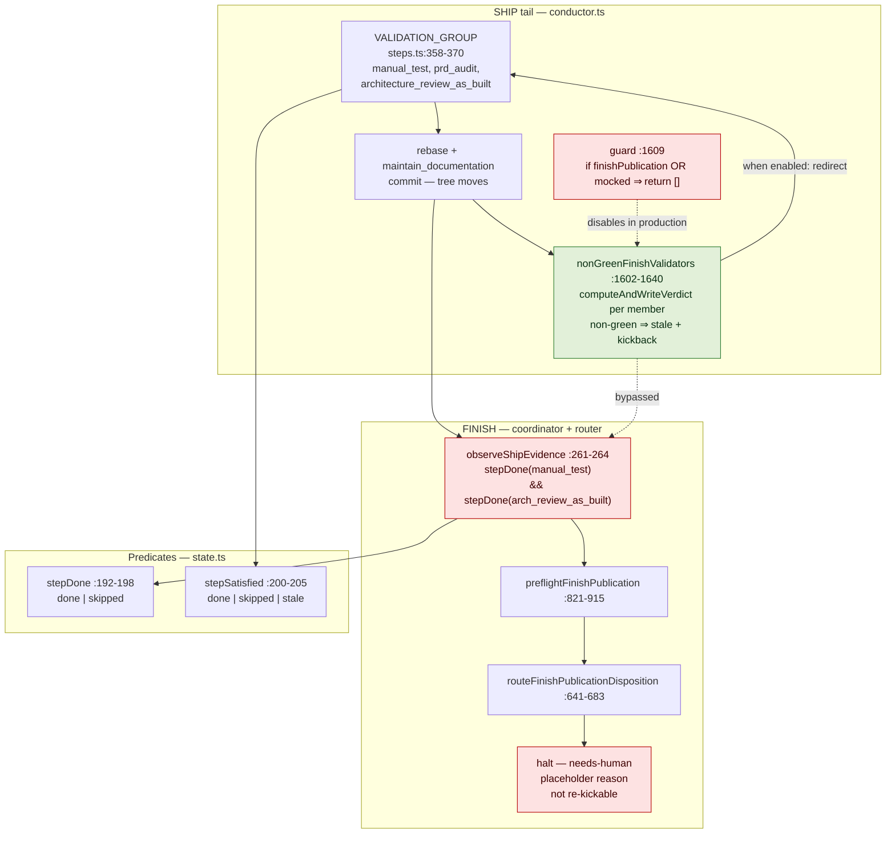
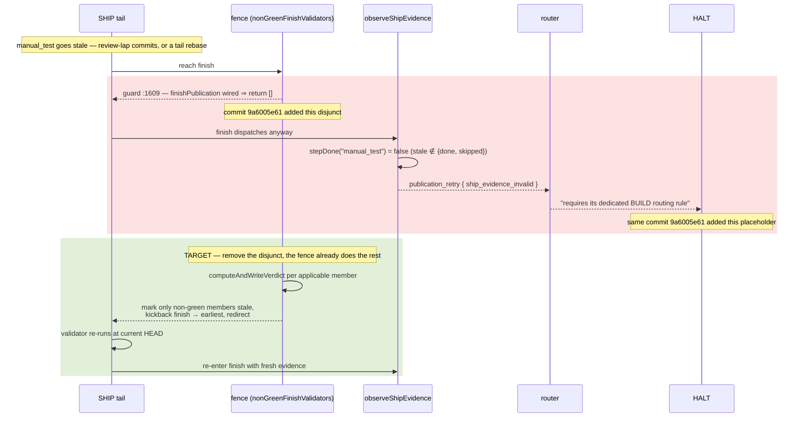

# Architecture: The current-HEAD publication fence

**Last updated:** 2026-08-16
**Scope:** The SHIP-tail validation fence (`nonGreenFinishValidators`, `conductor.ts:1602-1640`),
its guard clause at `:1609`, and the FINISH publication observer and router it protects
(`finish-publication-production.ts`, `finish-publication.ts`). Covers the halt filed as
jstoup111/ai-conductor#1613 and the restoration under the operator-confirmed scope.
All line references are at worktree base `b30e6c943`.

## Diagram: components (L3)

## Legend

- **Red** — the regression. The guard at `:1609` disables the fence on every production path, so
  the run reaches an observer that reads `stale` as absent and a router that has only a
  placeholder.
- **Green** — the fence itself, already written and already correct; it needs enabling, not
  authoring.
- **Dotted edges** — paths that exist but are inert in the configuration where the defect occurs.

## Diagram: how one commit produced the halt

## The single-commit root cause

`git log -L` on both lines resolves to the same commit —
`9a6005e6104c8dc0ce6a61206f021e2bb01b7138` (2026-08-04, #1295). It removed the **prevention** and
left the **cure** unwritten in one change:

| Line | Change | Effect |
|---|---|---|
| `conductor.ts:1609` | `if (!this.verifyArtifacts && !this.daemon)` → `if (this.finishPublication \|\| (!this.verifyArtifacts && !this.daemon))` | the APPROVED fence stops running in production |
| `finish-publication.ts:657-670` | placeholder halt added | invalid evidence has no route |

## Design decisions this raises (for `/architecture-review`)

1. **The fence is mandated, not optional.** `adr-2026-07-26-rebase-tail-current-branch-before-publication`
   is APPROVED and its decisions 3-5 require it before *any* finish dispatch or publication side
   effect. The engine has violated that decision since 2026-08-04. Restoring it is conformance
   work, not new design.
2. **Redirect to the earliest non-green validator, not to BUILD.**
   `adr-2026-07-13-kickback-build-no-op-escalation` forbids routing into a BUILD that is already
   evidence-complete ("never re-kick"), which is exactly the shape of a stale SHIP validator over a
   complete BUILD. The governing ADR's decision 5 already names the correct target.
3. **Recompute verdicts; never force-invalidate them.** The fence calls `computeAndWriteVerdict`
   and stales only what comes back non-green — the preserve-when-surface-unchanged behavior
   `adr-2026-07-22` and `adr-2026-07-20` require, and the reason a docs-only tail lap cannot
   oscillate the loop.
4. **Bounding is inherited.** The redirect is an ordinary `finish` kickback, already bounded by
   `MAX_KICKBACKS_PER_GATE` through the durable ledger. No new counter is warranted.
5. **The one open question is why the disjunct was added.** It carries no comment and no ADR, but
   #1295 added it deliberately. If a real incompatibility exists between the fence and the
   coordinator, this is a design fork for the operator rather than something to work around.

## Change Log

| Date | Change | Reason |
|------|--------|--------|
| 2026-08-16 | Initial generation | DECIDE for jstoup111/ai-conductor#1613 |
| 2026-08-16 | Redesigned around restoring the disabled fence rather than adding a FINISH→BUILD route | The repo-wide ADR sweep found `adr-2026-07-26` mandates the fence and `adr-2026-07-13` forbids the BUILD route |
