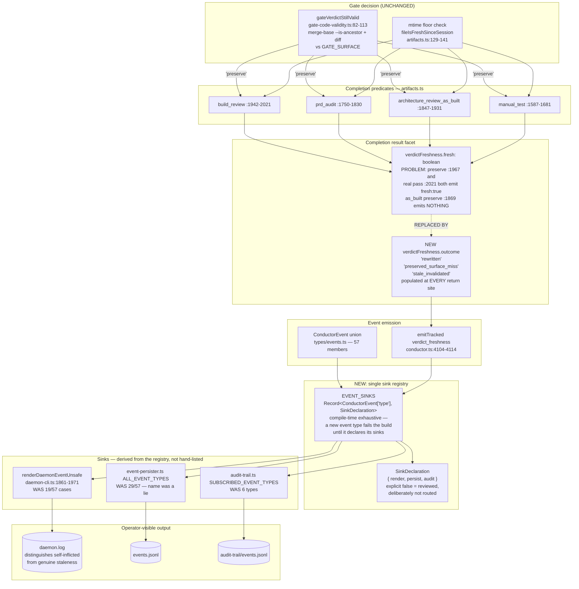

# Components: Staleness preserve-vs-invalidate decisions are invisible in daemon.log (#982)

**Last updated:** 2026-07-26
**Scope:** The telemetry path from a step's completion predicate to the operator's three
sinks — the `verdictFreshness` facet on the completion result (`engine/artifacts.ts`), its
translation to a `verdict_freshness` event (`engine/conductor.ts:4104-4114`), the
`ConductorEvent` union (`types/events.ts`), and the three sink registries
(`daemon-cli.ts` `renderDaemonEventUnsafe`, `engine/event-persister.ts` `ALL_EVENT_TYPES`,
`engine/audit-trail.ts` `SUBSCRIBED_EVENT_TYPES`).

**Out of scope:** the gating logic that *decides* preserve-vs-invalidate
(`engine/gate-code-validity.ts` `gateVerdictStillValid`) is untouched — only its reporting.

## Diagram

## Component responsibilities

| Component | Change | Responsibility |
| --- | --- | --- |
| `types/events.ts` | Modified | `verdict_freshness` gains the discriminated `outcome`; `fresh` is either derived from it or removed |
| `engine/artifacts.ts` | Modified | Every preserve / pass / stale return site populates `outcome`; the two bare `{ done: true }` preserve returns start populating the facet |
| `engine/conductor.ts` | Modified | Passes `outcome` through when emitting; no control-flow change |
| `engine/event-sinks.ts` | **New** | The `Record<ConductorEvent['type'], SinkDeclaration>` registry — the single exhaustive source of truth |
| `engine/event-persister.ts` | Modified | Derives its subscription set from the registry instead of `ALL_EVENT_TYPES` |
| `engine/audit-trail.ts` | Modified | Derives `SUBSCRIBED_EVENT_TYPES` from the registry |
| `daemon-cli.ts` | Modified | Adds the `verdict_freshness` case; the registry's `render` flag is reconciled against the switch |
| `engine/gate-code-validity.ts` | **Unchanged** | The preserve/rerun decision itself is not in scope |

## Key seam

The registry is the only new architectural element. Its contract is that
`Record<ConductorEvent['type'], SinkDeclaration>` is **total** — TypeScript rejects a missing
key — so adding a `ConductorEvent` member cannot compile until its sinks are declared. This
replaces three independently-drifting `Array<ConductorEvent['type']>` literals, a type that
permits silent omission and currently does so for 28 of 57 members in the list literally
named `ALL_EVENT_TYPES`.

`SinkDeclaration` must make `false` a first-class, reviewable value: "emitted but deliberately
not persisted" is a legitimate declaration. Exhaustiveness forces a **decision** per event
type, not membership in every sink — that distinction is what keeps `events.jsonl` volume a
deliberate choice rather than a side effect of the refactor.

## Risk

Routing the ~28 currently-dropped types into `events.jsonl` changes that file's volume and
content, and other tooling may parse it. The per-type sink decision is therefore made
explicitly during implementation and reviewed, rather than defaulting to "persist everything".
See `adr-2026-07-26-event-sink-registry-exhaustiveness.md`.
