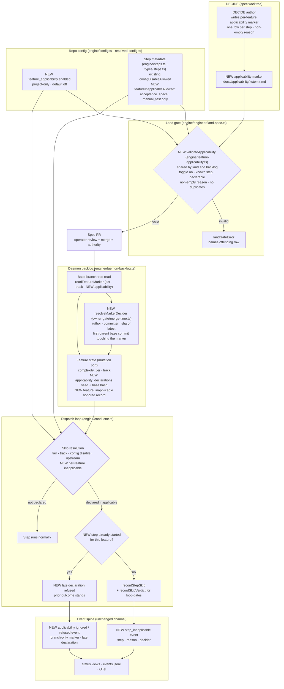

# Components: per-feature step applicability

**Last updated:** 2026-10-03
**Scope:** How a DECIDE-authored per-feature declaration that a step is inapplicable flows from
the spec worktree, through the land gate and the operator-merged spec PR, into the daemon's
base-tree marker read, and finally into dispatch-time skipping with a distinct recorded outcome on
the existing event spine. Tier, track, and repository-wide disable paths are shown only where the
new path sits beside them; their behavior is unchanged.

## Diagram

## Legend

- **NEW** marks components or fields this feature adds; unlabelled nodes exist today.
- `«stem»` is the feature's plan stem (equals the slug).
- The marker location, the decider-attribution source, and whether "inapplicable" is a new step
  status or a new skip cause are proposed here and decided in architecture-review.
- The spec PR merge is the operator authority: the daemon reads markers only from the base-branch
  tree, so a marker present only on a feature branch or worktree is never honored.

## Change Log

| Date | Change | Reason |
|------|--------|--------|
| 2026-10-03 | Initial generation | #1789 per-feature step applicability DECIDE |
| 2026-10-03 | Plan update: declarable set narrowed, shared validator, two state fields, decider helper | Conflict-check resolution and plan |
