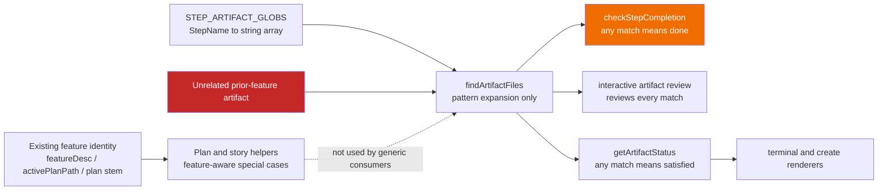
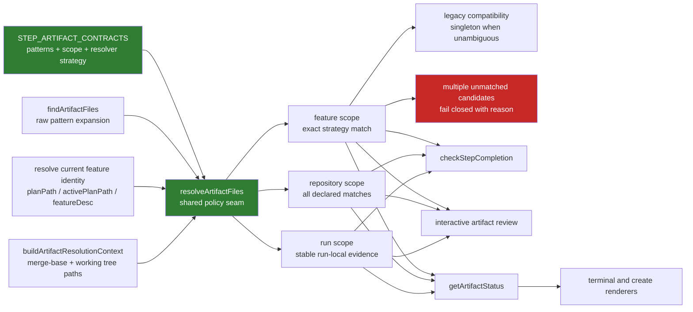

# Components: Feature-aware step artifact resolution

**Last updated:** 2026-07-28
**Scope:** Artifact declarations and the completion, interactive-review, and dashboard consumers affected by issue #993.

## Current architecture

The registry mixes feature-authored documents, repository-wide documents, run-local evidence, and workspace-wide test files. The generic consumers cannot distinguish those scopes, so an unrelated feature document can satisfy a feature step.

## Target architecture

## Component responsibilities

| Component | Responsibility |
|---|---|
| `STEP_ARTIFACT_CONTRACTS` | Declare patterns, scope, and the artifact-family resolver strategy at one reviewable site. |
| `findArtifactFiles` | Expand patterns only; it carries no feature policy. |
| Feature identity resolver | Reuse the active plan path, plan stem, and feature description ladder already present in `artifacts.ts`. |
| Artifact resolution context builder | Assemble explicit identity and engine-owned Git change-set evidence once per completion, review, or renderer refresh. |
| `resolveArtifactFiles` | Apply the declared scope and resolver strategy, preserve unambiguous legacy artifacts, and report ambiguity instead of guessing. |
| Completion, review, and status consumers | Consume the same resolved file set while retaining their distinct pass/prompt/render behavior. |

## Legend

- Green nodes are the new shared declaration and resolution seam.
- Orange marks the current false-positive completion consumer.
- Red marks unsafe foreign-artifact input or the target fail-closed ambiguity outcome.
- `repository` and `run` scopes preserve intentional non-feature artifacts; no blanket stem filter is introduced.

## Change Log

| Date | Change | Reason |
|---|---|---|
| 2026-07-28 | Initial current/target component flow | DECIDE architecture for issue #993 |
| 2026-07-28 | Added the planned once-per-operation context builder | Plan tasks 4, 8, 10, and 11 make feature and change-set inputs explicit without per-pattern Git discovery |
