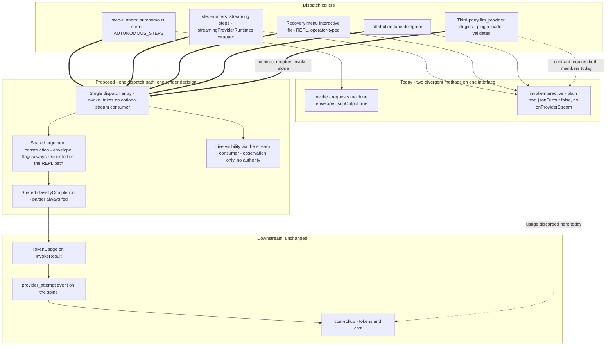
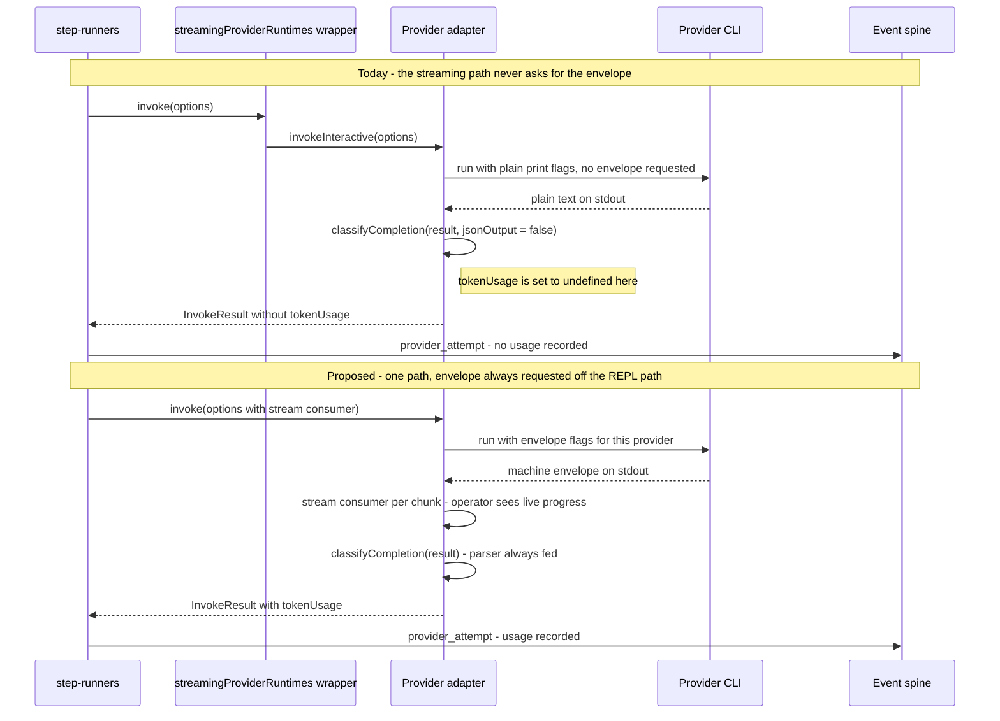

# Components: Unified provider dispatch path

**Last updated:** 2026-08-24
**Scope:** Proposed collapse of `LLMProvider.invoke()` and `LLMProvider.invokeInteractive()` into
one dispatch path parameterized by whether the run renders live. Covers both built-in adapters,
the `streamingProviderRuntimes` wrapper that today swaps one method for the other, and the plugin
contract that `plugin-loader.ts` enforces on third-party `llm_provider` implementations. The
reporting of totals is out of scope (deferred to #1863).

## Diagram

## Sequence: one streaming dispatch, today versus proposed

## Legend

- **Solid arrows** — the call path taken today.
- **Double arrows (`==>`)** — the proposed call path.
- **Dotted arrows** — a contract or data relationship rather than a call: the plugin contract
  edge, and the point where usage is discarded today.
- **`streamingProviderRuntimes` wrapper** — the object in `step-runners.ts` whose only purpose is
  to make `invoke` route through `invokeInteractive`. Under the proposal it has nothing left to
  swap; whether it is deleted or retained for its other delegation duties is a design question the
  architecture review owns.
- **Plugin contract edge** — `plugin-loader.ts` today hard-fails an `llm_provider` plugin that does
  not implement `invokeInteractive`. The approved decision removes that member from `LLMProvider`
  and from the loader's required set, so the contract becomes `invoke` alone. This is strictly more
  permissive: no plugin that loads today stops loading, and a class with an extra method still
  satisfies `implements`. See `adr-2026-08-24-one-dispatch-member-on-the-provider-contract`.
- **The stream consumer** — live observation is carried by an optional consumer object on
  `InvokeOptions`, deliberately not a boolean. It is the named extension point for future
  burn-based context control; its authority stays none, per
  `adr-2026-08-19-live-provider-stream-observation`.
- The REPL path is deliberately kept on plain text: an operator-facing conversational session
  rendered as a machine envelope is unusable, so it is the one caller that does not request one.

## Change Log

| Date | Change | Reason |
|------|--------|--------|
| 2026-08-24 | Initial generation | DECIDE for jstoup111/ai-conductor#1857 — streaming dispatches record no token usage or cost |
| 2026-08-24 | Plan-update pass | Reflects the approved decisions: `invokeInteractive` is removed rather than deprecated, and live observation is a stream-consumer seam rather than a render mode |
