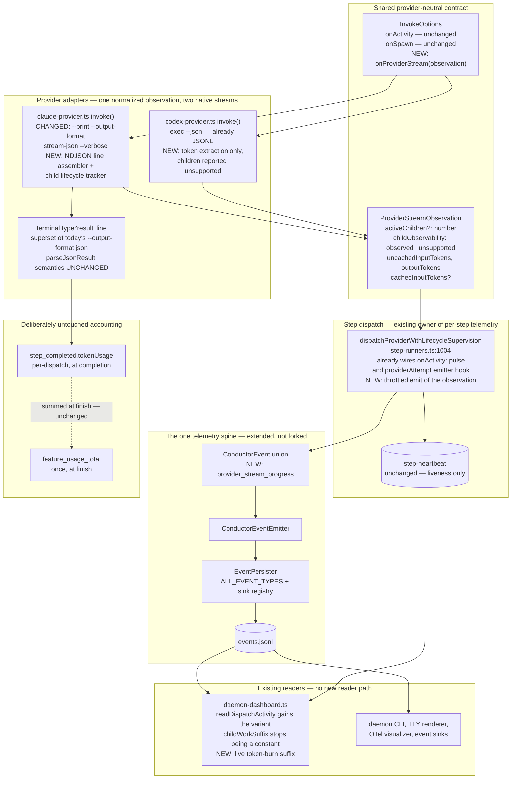
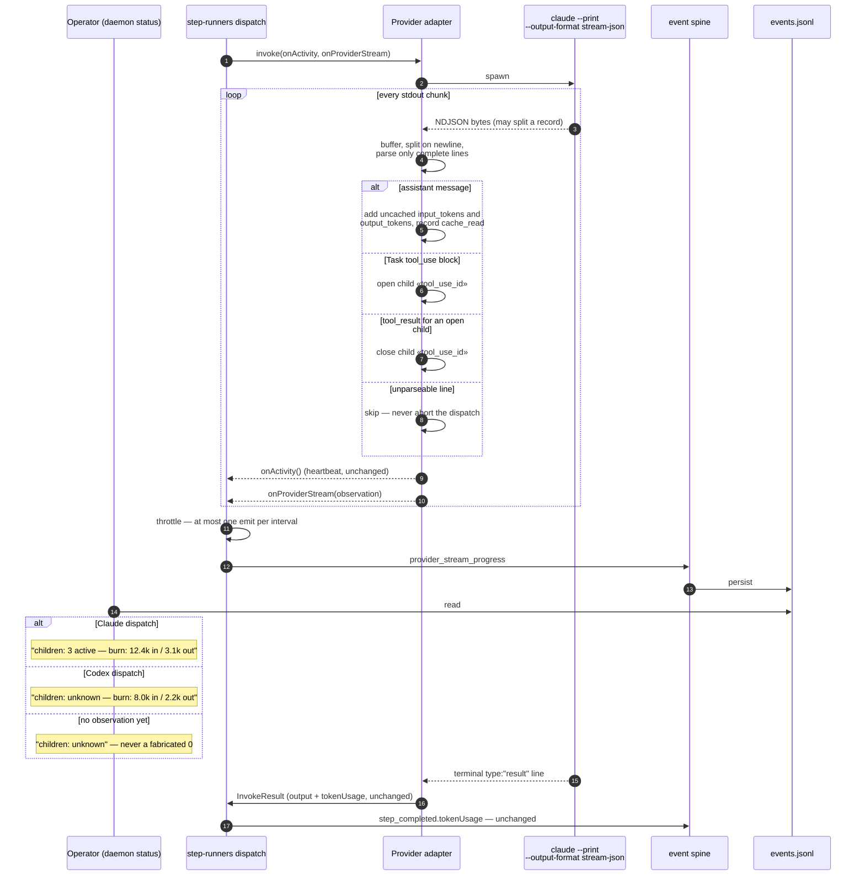

# Components: Live subagent activity and per-step token burn (#1441)

**Last updated:** 2026-08-19
**Scope:** The provider-dispatch observation seam — the Claude adapter's output format and stream
parsing (`claude-provider.ts:520-660`), the Codex adapter's existing `exec --json` JSONL
(`codex-provider.ts:806-823`), the shared `InvokeOptions` observation contract
(`llm-provider.ts:240-282`), the step dispatch that already owns the heartbeat pulse and the
lifecycle-event hook (`step-runners.ts:1004-1040`), the `ConductorEvent` union
(`types/events.ts`), and the live operator surface (`daemon-dashboard.ts:386-470`, `:769`, `:915`).

## Diagram

## Lifecycle sequence

## Component Notes

- **The format switch is a superset, not a rewrite.** Verified by probe on 2026-08-19: the
  terminal `type:"result"` line of `--output-format stream-json --verbose` carries the same
  `result`, `usage.{input_tokens, output_tokens, cache_read_input_tokens,
  cache_creation_input_tokens}`, `total_cost_usd`, `num_turns` and `duration_ms` that
  `parseJsonResult` reads from the single object today. The adapter therefore selects the terminal
  result line instead of parsing all of stdout, and the `InvokeResult` contract — the seam every
  step's output flows through — is unchanged by construction. This is the load-bearing design fact
  and it carries its own ADR.

- **No parallel channel.** Per `.agents/skills/event-spine/SKILL.md`: a channel is being added
  (a stream observer), the concern is an occurrence in time (a child opened, a message consumed
  tokens), and the writer is the conductor's own process — so none of exceptions A, B, or C apply
  and the verdict is *extend the union*. The observation rides `ConductorEventEmitter` →
  `EventPersister` → `.pipeline/events.jsonl`, the exact reader path `readDispatchActivity` already
  walks for `step_started` and `acceptance_red`. No sidecar file, no counter stamped into an
  existing artifact.

- **`unknown` is a value the schema carries, not an absence.** `childObservability:
  'observed' | 'unsupported'` is explicit on the event, so the dashboard distinguishes "Codex
  cannot have subagents" from "no observation has arrived yet" from "three children are running".
  `childWorkSuffix()` currently hardcodes `(children: unknown)` citing this issue; it becomes a
  function of the event, and it still renders `unknown` — never `0` — whenever the count is not
  observed. This preserves desired outcome 4 rather than replacing it.

- **A child finishing is distinguishable from the step waiting.** The count drops to zero when the
  last `Task` tool_result closes, while `activityState` (already computed from the heartbeat and
  the completion predicate, delivered by #1246) independently reports `working` or `waiting` with
  its `completionCondition`. "0 children + waiting + a named completion condition" is exactly the
  state an operator today cannot see, and it is the conjunction of two signals rather than a new
  one.

- **Token burn is reported uncached-first.** `usage.input_tokens` on each assistant message is the
  fresh, billed input; `cache_read_input_tokens` is reported separately and never summed into it.
  This matches `TokenUsage`'s existing `input` / `cacheRead` split and `feature_usage_total`'s
  `inputTokens` ("Fresh (non-cached) input tokens") so the live number and the end-of-feature
  number mean the same thing.

- **Emission is throttled at the dispatch, not the adapter.** A fast stream produces many
  observations per second; unthrottled emission would turn `events.jsonl` into a per-message
  ledger. `step-runners.ts` already owns exactly this pattern for the heartbeat
  (`createHeartbeatPulse`, default 5 s minimum interval), so the throttle lives beside it and the
  adapter stays a pure normalizer.

- **Partial lines are a real failure mode, not a theoretical one.** A piped stdout delivers
  arbitrary byte chunks; a record is routinely split across two `data` events. The adapter buffers
  and emits only on complete newline-terminated records, and an unparseable line is skipped rather
  than aborting — observation must never gain authority over dispatch, the same rule `onActivity`
  and `onSpawn` already carry.

- **The interactive path is out of scope.** `invokeInteractive` inherits stdio so the operator is
  already watching the session; changing its format would change what a human sees on the terminal
  for no benefit. Only autonomous `invoke()` dispatches are converted.

## Change Log

| Date | Change | Reason |
|------|--------|--------|
| 2026-08-19 | Initial generation | DECIDE for #1441, tier M, approach A (all steps, both providers) |
