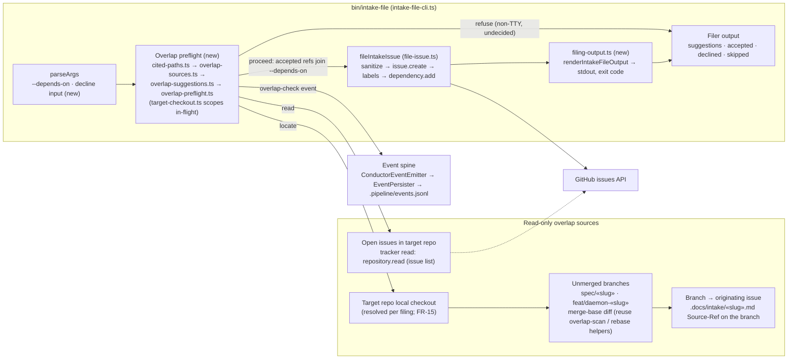
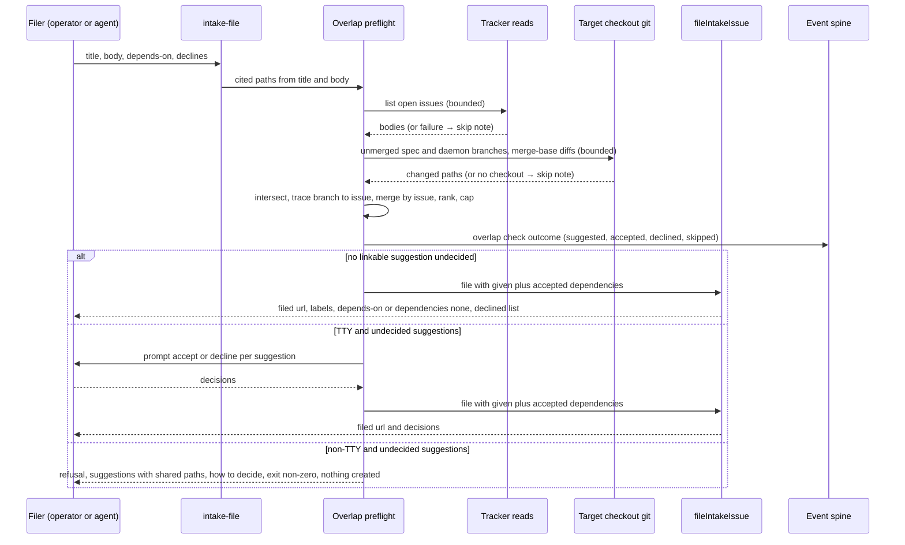

# Architecture: Intake filing-time overlap preflight

**Issue:** #1606 · **Stem:** `surface-evidence-path-overlap-as-suggested-depende` · **Tier:** M (lightweight diagram)
**Last updated:** 2026-09-28
**Scope:** The `bin/intake-file` → `fileIntakeIssue` filing path, plus a new pre-create overlap
preflight and the read-only sources it consults. Downstream claim, dispatch, and the DECIDE-time
`overlap-scan` stay unchanged.

## One-line

Before `issue.create`, the filer computes the overlap between the new intake's cited paths and
(a) the paths cited by open issues and (b) unmerged `spec/*` and `feat/daemon-*` diffs in the
**target** repository's checkout. It then either proceeds (no overlap or every suggestion decided),
prompts (TTY), or refuses without creating anything (non-TTY with undecided suggestions).

## Components

## Filing flow

> **Amended 2026-09-28 by #1606 (conflict-check, operator-approved):** #742 lands first and removes `bin/intake-file`. The bundled helper runs `intake-file-cli.ts` from the caller's directory with no `cd`, so the CLI process's working directory is the invoking directory, and invariant 4 holds without any wrapper hand-off. The in-flight branch set excludes branches whose `.docs/shipped/«slug».md` exists on the base ref (squash-merged). Engine-internal `fileIntakeIssue` callers get no preflight.

## Invariants

1. **Pre-create only.** The preflight completes, or refuses, before `issue.create` runs. A refusal
   creates nothing on GitHub.
2. **Read-only sources.** The preflight only reads open issues, branch refs, merge-base diffs and
   branch-tree `.docs/intake/` files. The only writes in the whole filing are the existing ones on
   the newly created issue.
3. **Fail-open on the check itself (FR-14).** A failed tracker read, a missing target checkout, a
   missing merge base or a hit bound each become a skip note. None of them becomes a refusal.
   Refusal comes only from undecided **linkable** suggestions the check actually found.
4. **Target-scoped (FR-15).** Branch diffs come from the target repo's checkout, never from the
   harness directory that `bin/intake-file` `cd`s into.
5. **No-overlap parity (FR-8).** With zero suggestions, the `fileIntakeIssue` inputs and the output
   are the same as today, plus at most one "overlap check ran" line.
6. **One telemetry channel.** Check outcomes go on the existing event spine that `intake-file-cli`
   already starts. No sidecar file is added.

## Legend

- **(new)** marks components this feature adds. Everything else already exists.
- `«slug»` is a placeholder for a feature slug.
- Dotted edge: the tracker read is served by GitHub.

## Change Log

| Date | Change | Reason |
|------|--------|--------|
| 2026-09-28 | Initial generation | #1606 DECIDE |
| 2026-09-28 | Amendment note: #742 ordering, shipped-branch exclusion, engine callers | #1606 conflict-check |
| 2026-09-28 | Plan update: named the planned modules and the output renderer | #1606 /plan |
