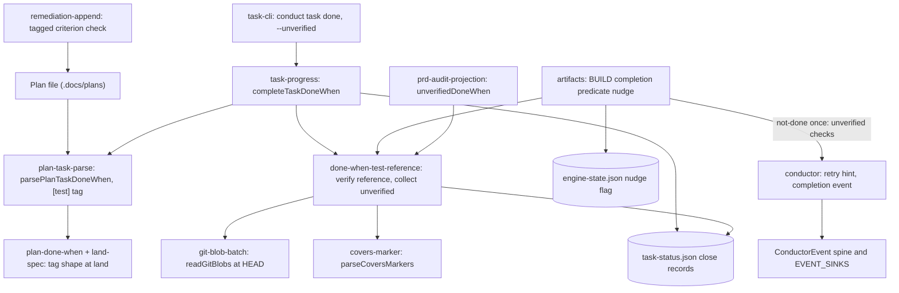

# Components: Test-tagged Done-when checks verified at task close

**Last updated:** 2026-10-02
**Scope:** Engine components touched by #2758 and how they connect. The runtime flow is in [the sequence diagram](sequences/tasks-close-with-boilerplate-done-when-evidence-mi.md).

## Diagram

## Legend

New: `done-when-test-reference` (text-only reference verification and the unverified collector), the `[test]` tag rule, the `--unverified` close form, the BUILD nudge outcome and its engine-state flag, the `build_done_when_unverified` event, and the `prd_audit` projection field. Changed: `completeTaskDoneWhen` stamps `verified` or `unverified`; `buildRemediationDoneWhenChecks` tags criterion checks. Unchanged: trailer resolution, the uncommitted-work floor, halt classes, and `build_review`. `adr-2026-08-22-done-when-evidence-at-task-close` D5-D9 governs.

## Change Log

| Date | Change | Reason |
|------|--------|--------|
| 2026-10-02 | Initial component view | #2758: tasks closed on boilerplate Done-when evidence |
