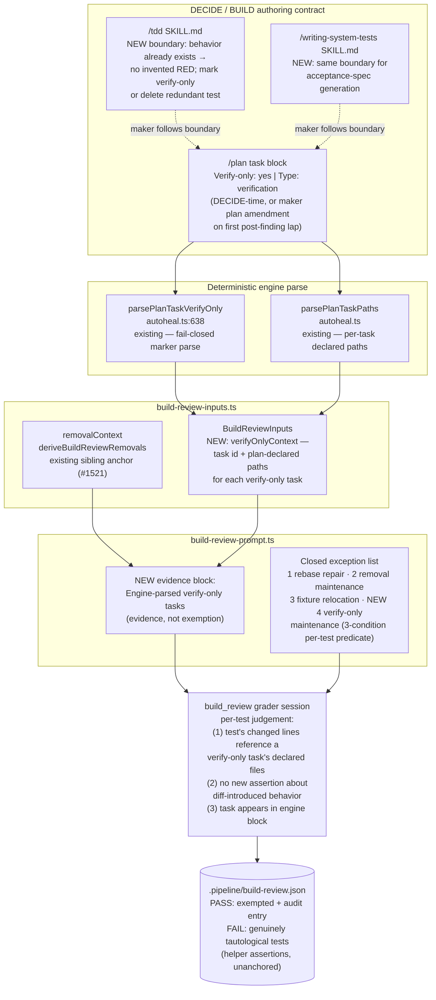

# Components: Verify-Only-Anchored Tautology Exception (#1579, absorbs #1529)

**Last updated:** 2026-08-15
**Scope:** The evidence flow for the fourth closed Tautology exception ("verify-only
maintenance") — plan-task marker parsing (`autoheal.ts` `parsePlanTaskVerifyOnly`), the
build_review input assembly (`build-review-inputs.ts`), the grader prompt rendering
(`build-review-prompt.ts`), and the maker-side authoring boundaries in the `tdd` and
`writing-system-tests` skills.

## Diagram

## Legend

- **NEW** — surfaces added or changed by this feature; everything else exists today.
- Solid arrows: data/evidence flow. Dotted arrows: behavioral contract (skill instructs maker).
- The engine block is *evidence, not exemption* — same doctrine as the #1521 removal anchor:
  the grader still applies a closed per-test predicate; an unanchored pre-diff-passing test
  still FAILs Tautology.
- Deferred (follow-up intake, Approach B): replacing the plan-marker anchor with engine-run
  pre-diff pass/fail evidence per changed test.

## Change Log

| Date | Change | Reason |
|------|--------|--------|
| 2026-08-15 | Initial generation | DECIDE phase for #1579 |
