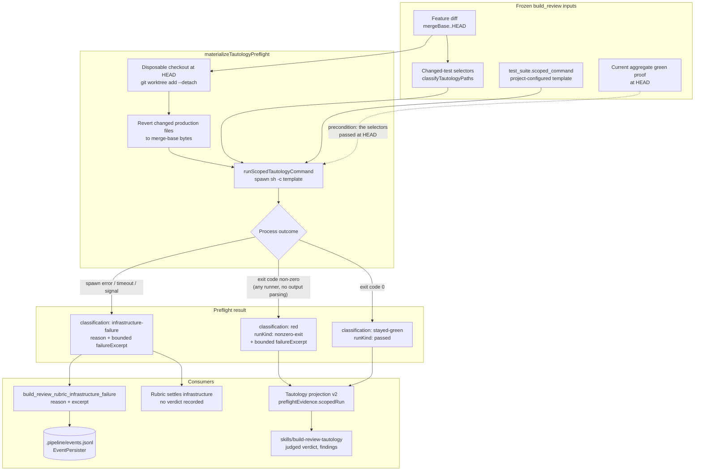

# Components: Framework-agnostic tautology scoped-run classification

**Last updated:** 2026-08-17
**Scope:** How the Tautology preflight's counterfactual scoped run is classified, what evidence
reaches the judging skill, and where an infrastructure failure's runner output is retained.

## Diagram

## What changes

**The classifier is deleted, not extended.** `classifyTautologyScopedFailure` matched Vitest and
pytest phrasing (`Test Files N failed`, `AssertionError`, `no tests collected`) and returned
`collection-failure` for everything else. Every other runner — RSpec's `N examples, M failures`,
`go test`, JUnit, PHPUnit, minitest — fell into that catch-all. The engine now reads the process exit
code and nothing else, so a non-zero counterfactual is RED on every runner by construction rather
than by pattern coverage.

**The union narrows.** `TautologyScopedRunResult` loses `no-tests` and `collection-failure`, and
`test-failure` becomes `nonzero-exit` — a name the engine can actually justify from an exit code. The
infrastructure reasons `scoped-run-no-tests` and `scoped-run-collection-failed` are removed with
them. What survives as infrastructure is exactly the process-level set the engine observes directly:
launch error, timeout, and signal.

**One distinction moves from machinery to judgement.** The deleted `no-tests` bucket was the only
mechanical detection of "the selector matched no executable test", and it worked for two frameworks
while silently misfiring for the rest. It is replaced by a rule in the judging skill, which already
receives the bounded failure excerpt and the executed selector list. This follows the repository's
Design Principle: machinery owns the bookkeeping (selector derivation, revert materialization,
bounding, caching, persistence), and the judgement is made where the question is genuinely a
judgement — with the answer constrained by the existing judged-result schema.

## Component responsibilities

| Component | Responsibility | Changed |
| --- | --- | --- |
| `step-runners.ts::runScopedTautologyCommand` | Spawn the configured scoped command against the reverted checkout; map the process outcome to a closed result | Yes — classifier deleted, exit code only |
| `build-review-tautology-preflight.ts::materializeTautologyPreflight` | Materialize the counterfactual, run it, classify red/stayed-green/infrastructure, bound the excerpt, cache | Yes — narrowed union, infra excerpt |
| `build-review-coordinator.ts::preflightProjection` | Project the preflight into the closed v2 prompt form | Yes — carries the infra excerpt |
| `build-review-coordinator.ts` rubric resolution | Settle a preflight infrastructure failure without dispatching the rubric; emit the spine event | Yes — event carries the excerpt |
| `types/events.ts` | The `ConductorEvent` union | Yes — one additive optional field |
| `skills/build-review-tautology/SKILL.md` | Judge the Tautology concern from the closed projection | Yes — no-executed-test rule, `runKind` values |
| `scoped-run.ts` | The other scoped runner, already exit-code only | No — the precedent this change aligns to |

## Boundaries this change does not cross

- The counterfactual still runs exactly once. No second scoped run, no control run, no new
  `test_suite` invocation.
- No new configuration key. The existing `test_suite.scoped_command` template is unchanged, including
  its required `{selectors}` placeholder.
- No change to selector derivation, the revert materialization, the rename handling (#1624), the four
  closed exceptions, the preflight cache key, or the judged-result schema.
- No new telemetry channel. The infrastructure excerpt rides the existing
  `build_review_rubric_infrastructure_failure` event to `.pipeline/events.jsonl`.
- `#1593`'s decision stands: a reverted-tree run that fails because it cannot load is still RED. The
  test demonstrably does not pass without the diff, which is what the counterfactual asks.
