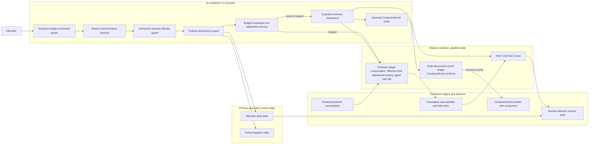
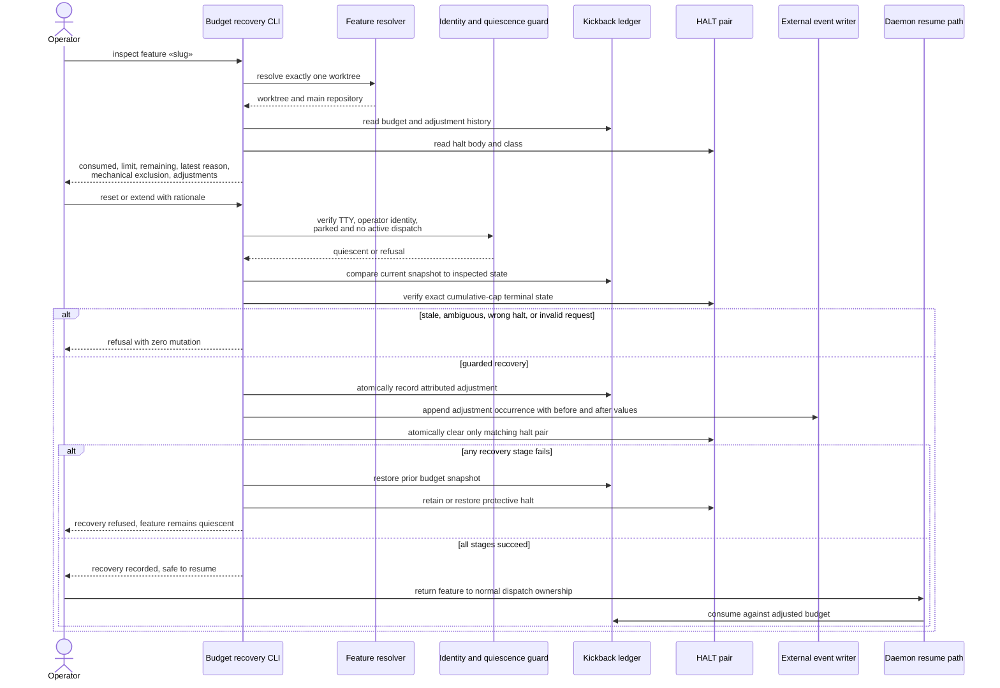
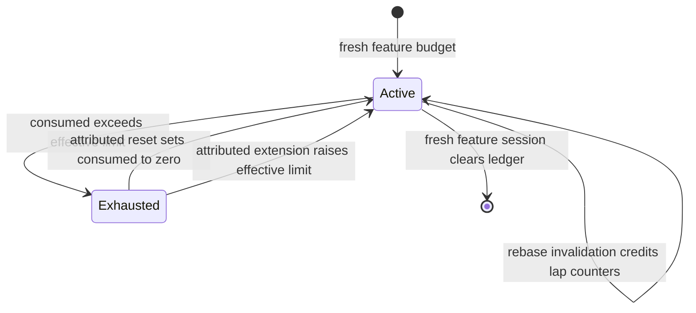
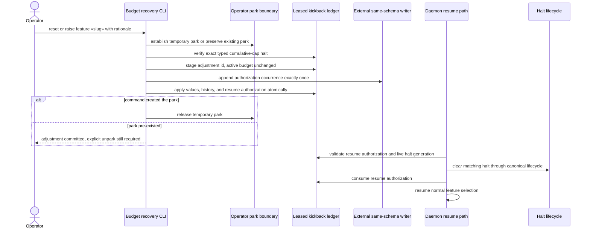
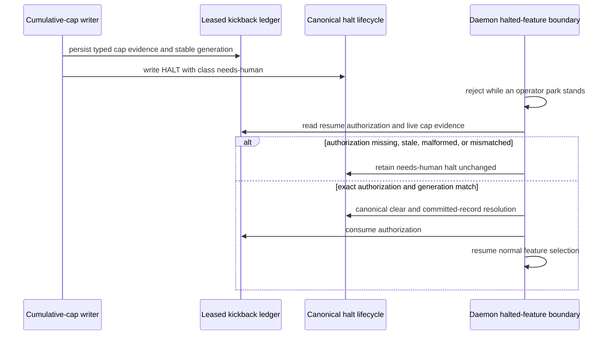
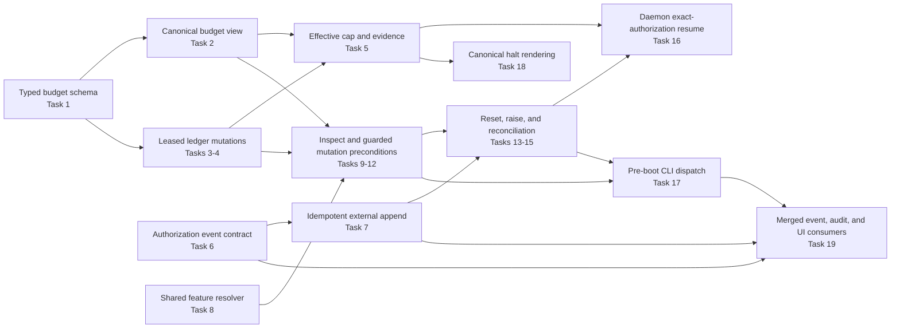

# Architecture: guarded cumulative kickback budget recovery

**Last updated:** 2026-08-29
**Scope:** Medium-tier proposed architecture for inspecting and adjusting one halted feature's
`build_review` cumulative budget, preserving the existing mechanical-fault lane and event spine.

## Component diagram (C4 L3)



## Recovery sequence



## Budget state and invariants



- `cumulative` remains the active semantic-lap count used by the engine.
- The effective limit defaults to the existing constant; a legacy entry with no override resolves to
  that default.
- Reset changes the active count only. Extension changes the selected feature's effective limit
  only. Neither mutates repository-wide configuration or the separate per-tree count.
- Each adjustment record carries a stable id, kind, before/after count and limit, operator,
  rationale, and timestamp. Repeated delivery of the same id is idempotent.
- The existing `mechanicalFaults` and `lastMechanicalFault` fields remain outside cumulative
  consumption and outside reset/extension mutation.
- The cap writer persists typed exhausted-state evidence beside the budget before writing the human
  halt. Recovery requires that typed evidence, the current budget generation, and the halt pair to
  agree; prose matching alone never authorizes mutation.
- A quiescence guard prevents a daemon dispatch from consuming or rewriting the ledger during the
  operator transaction. Failure is toward parked/halted.

## Event spine verdict

```
Event spine
  Channel?    yes — an operator budget adjustment is an occurrence consumers must observe
  Concern:    occurrence — who changed which feature budget, when, and from/to what values
  Verdict:    sibling ledger, same ConductorEvent schema
  Exception:  A and B — the operator CLI is a separate process and must not share an append writer
```

Budget counts, adjustment history, and typed exhausted evidence remain durable control state under
exception C; they are not reconstructed from telemetry. The operator occurrence is a new typed
`ConductorEvent` emitted through the existing external-process writer and tailed onto the normal bus.
No bespoke sidecar, ad-hoc log, or second event schema is introduced.

## Existing seams reused

- Named feature/worktree resolution and interactive identity follow the current operator-facing
  `build-review` command boundary.
- Compare-before-mutate behavior and protective halt restoration follow the operator rewind
  transaction pattern.
- Atomic ledger writes continue through the kickback ledger's temp-file-and-rename boundary.
- External-process telemetry follows the existing same-schema event writer used by operator review
  decisions.
- Normal daemon park, halt, and resume semantics remain authoritative; budget recovery does not
  dispatch, build, or merge the feature.

> **Amended 2026-08-29 by #1760:** Architecture review found that the original sequence's direct
> CLI clearing cannot atomically cover ledger state, the external event, halt markers, park state,
> and committed halt presentation. The approved target is a staged ledger adjustment followed by a
> daemon-owned resume handoff. The corrected sequence below supersedes only the direct-clear arrows;
> the component boundaries and state invariants above remain unchanged.

## Corrected recovery sequence after architecture review



## Change log

| Date | Change | Reason |
|---|---|---|
| 2026-08-29 | Initial Medium-tier component, sequence, and state diagrams | Composer DECIDE for jstoup111/ai-conductor#1760 |
| 2026-08-29 | Added corrected staged-adjustment and daemon-handoff sequence | Architecture review removed an infeasible multi-file direct-clear transaction |
| 2026-08-29 | Kept `needs-human`; moved exact cap identity to typed ledger evidence | Conflict-check preserved the approved halt taxonomy and committed-record lifecycle |
| 2026-08-29 | Added dependency-ordered implementation wiring | Plan update mapped 19 tasks onto the approved component boundaries |

> **Amended 2026-08-29 by #1760:** Repository-wide conflict-check found that naming
> `kickback-cap` as a new `HALT.class` contradicts the approved two-disposition engine halt
> contract. The controlling design keeps `HALT.class = needs-human`; typed ledger evidence and its
> generation establish the exact cap identity. The daemon checks an explicit matching authorization
> before the generic needs-human retention branch. The earlier “cumulative-cap terminal” labels
> remain domain descriptions, not a new sidecar value.

## Corrected halt classification and authorization sequence



> **Plan update 2026-08-29 by #1760:** The implementation plan resolves the approved architecture
> into the dependency-ordered wiring below. This is additive implementation detail; it changes no
> accepted component boundary, state invariant, event-spine verdict, or halt classification.

## Planned implementation wiring


