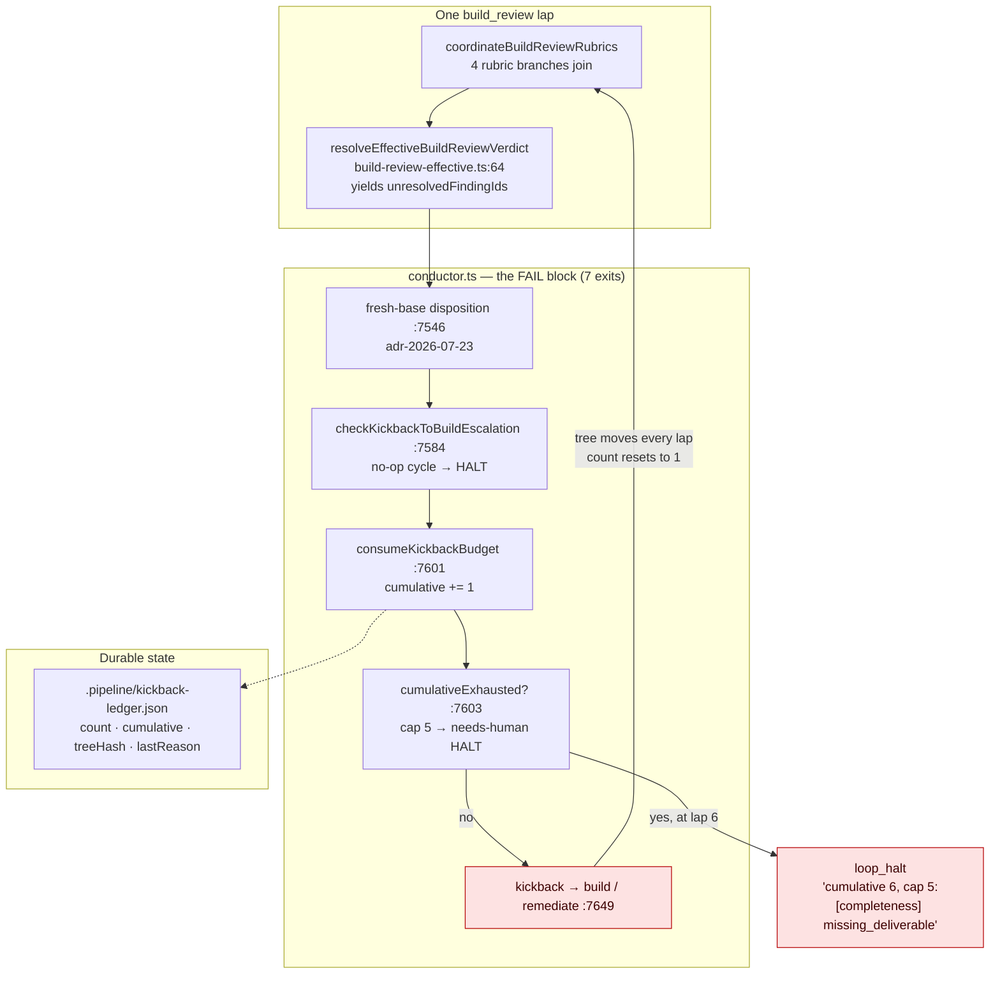
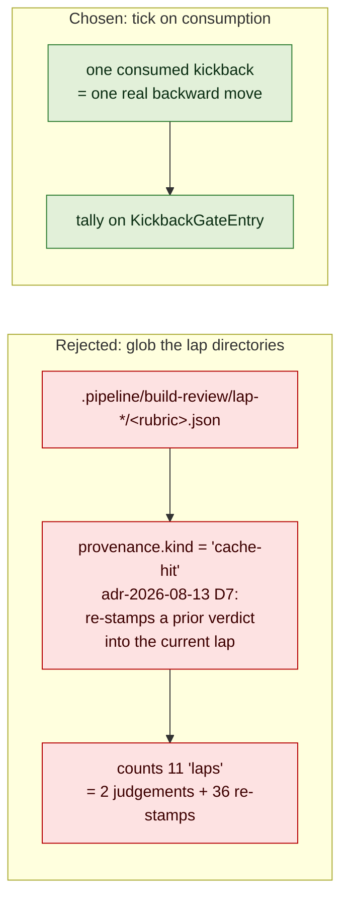
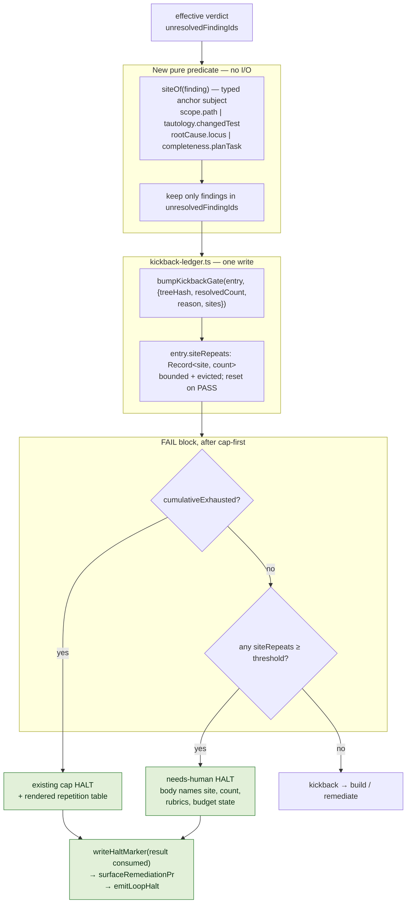
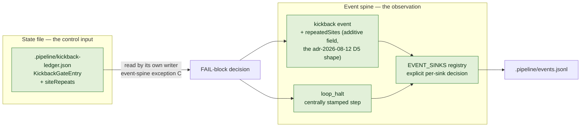

# Architecture: Site-repetition short-circuit for build_review

**Last updated:** 2026-08-17
**Scope:** The `build_review` FAIL routing block in `conductor.ts`, the durable kickback ledger
(`kickback-ledger.ts`), a new pure repetition predicate, and the `kickback` / `loop_halt` members of
the `ConductorEvent` union. Covers jstoup111/ai-conductor#1652.
All line references are at worktree base `f5a2b29c8`.

## Diagram: why the run spins today (L3)

## Legend

- **Red** — the two defects, both real, neither an absent bound. The loop re-enters because every
  remediation lap commits real work, so `madeProgress` is true and `count` resets to 1
  (`kickback-ledger.ts:167`); only `cumulative` survives, and it terminates at lap 6 — after roughly
  two hours of dispatches. The halt body is `lastReason`, the raw grader excerpt, which names a
  rubric and a concern kind but never the **site** that kept failing. Nothing in the block asks
  *which thing* is not converging.

## Diagram: the counting unit that does not exist (L3)

Measured on the two features with persisted laps on disk: `stale-manual-test-…` has 11 lap
directories carrying **2** fresh rubric judgements and 36 cache re-stamps across 44 artifacts;
`live-daemon-e2e-…` has 5 lap directories and **zero** fresh judgements. A detector that globs
`lap-*` measures cache behavior, not convergence. This retracts the intake's first hypothesis
("the persisted lap dirs already carry every signal") on its own evidence.

## Diagram: the added exit (L3)

## Legend

- **Ordering is fixed by three APPROVED decisions and is not free.** The predicate runs after the
  fresh-base disposition (`adr-2026-07-23` — findings graded on a stale base are discarded, so they
  must not tick a tally) and after the cumulative cap check (`adr-2026-07-27` and `adr-2026-08-16`
  D6 both pin cap-first, so a run that trips the cap still reports the ping-pong reason). The
  `adr-2026-08-12` review records the cumulative check's own slot as "immediately after the D2
  escalation check and before the existing per-tree `exhausted` branch"; the new exit sits directly
  after it.
- **The predicate is pure and takes no I/O**, mirroring `classifyBuildProgress` /
  `shouldEscalateKickback` in `kickback-escalation.ts`. Unresolved-ness comes from the current lap's
  own join, never from a prior lap's artifact — `adr-2026-08-03-build-repair-member-reuse-validity`
  binds that no on-disk verdict is sufficient authority on its own.
- **Both halts render the repetition table.** The cap halt keeps its distinct reason
  (`adr-2026-06-30` and `adr-2026-08-16` D6 require distinct reasons per exit) and gains the body
  that tells an operator what repeated; that is issue outcome 2, and it is delivered even on the
  path where the new bound never fires.

## Diagram: state and spine (L2)

## Legend

- **No new channel, no new file.** `adr-2026-08-12`'s rejected alternative — deriving the count by
  parsing a ledger at decision time — is why the tally is state and not a scan: "State belongs in
  the state file; the event is the observation of it." Exception C in the event-spine skill legalises
  the durable read-back *only because* the occurrence is also emitted, which is precisely why D5 put
  `cumulativeCount` on the `kickback` event; `repeatedSites` follows that shape.
- `adr-2026-08-11-halt-events-ride-the-persisted-spine` forbids a per-site halt payload variant, so
  there is no new halt event — the existing central `emitLoopHalt` carries it.
  `adr-2026-07-26-event-sink-registry-exhaustiveness` requires the additive field's sink decision to
  be explicit rather than inherited.

## Invariants this change must not break

| Invariant | Source | How it is preserved |
|---|---|---|
| `MAX_KICKBACKS_PER_GATE` keeps its value and meaning | `adr-2026-07-26` | untouched; the tally is a third, independent field |
| A tree change earns a fresh `count` budget (fail-open) | `adr-2026-07-26` D1 | `madeProgress` logic unchanged |
| A `build_review` PASS clears convergence state | `adr-2026-08-12` D2 | `siteRepeats` resets with `cumulative` |
| A legacy ledger without the new field reads clean | `adr-2026-08-12` D1 | `isKickbackGateEntry` folds absent → `{}`, never rejects |
| No LLM in the bound's decision path | `adr-2026-08-12` consequences | predicate is pure; no dispatch added |
| Cap-first ordering | `adr-2026-07-27`, `adr-2026-08-16` D6 | new exit sits after the cap check |
| Every HALT carries a distinct reason and its class | `adr-2026-06-30`, `adr-2026-08-16` D6 | new reason string; class `needs-human` |
| `needs-human` survives the re-kick sweep | `daemon-rekick.ts:173-193` | class chosen deliberately, not defaulted |
| Halt writes reuse marker → PR surfacing → `loop_halt` | `architecture-review-2026-07-04` cond. 2 | same sequence as the cap halt beside it |
| `.pipeline` reads never throw at a routing boundary | `adr-2026-07-11` | tally is in-memory state, not a scan |
