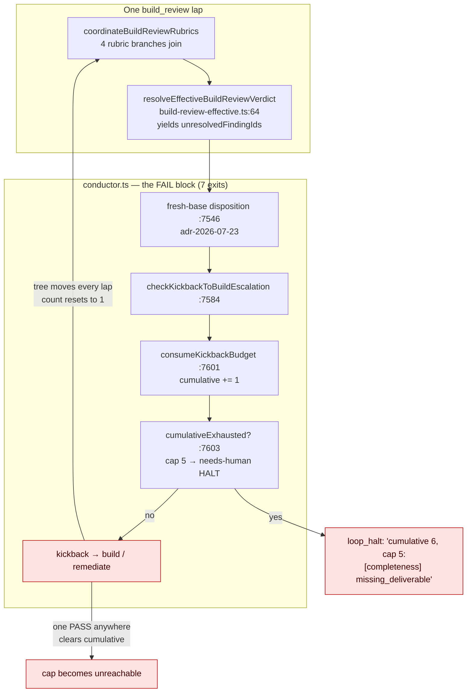
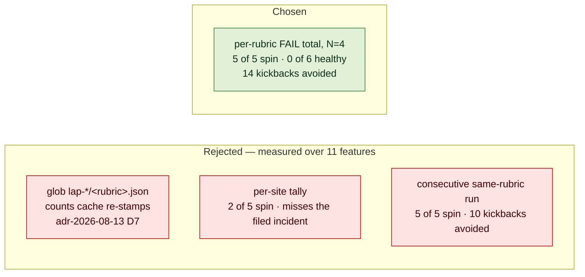
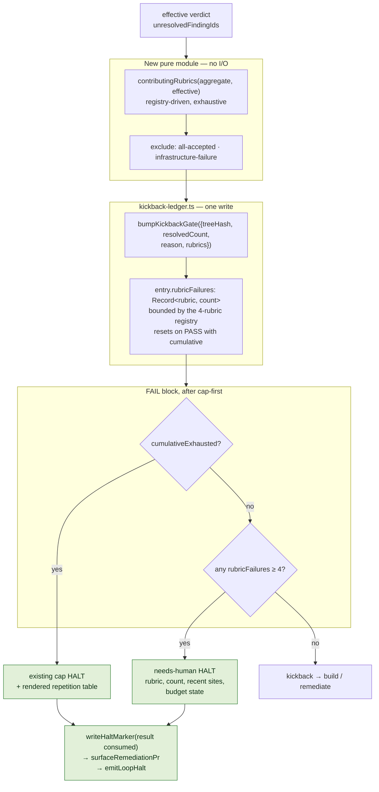
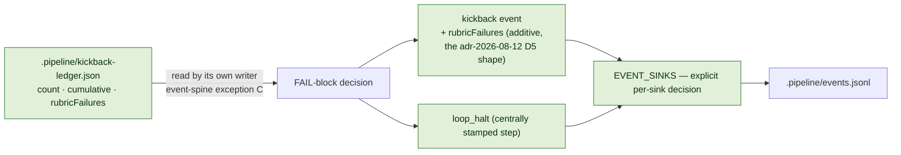

# Architecture: Rubric-repetition short-circuit for build_review

**Last updated:** 2026-08-17
**Scope:** The `build_review` FAIL routing block in `conductor.ts`, the durable kickback ledger
(`kickback-ledger.ts`), a new pure repetition module, and the `kickback` / `loop_halt` members of the
`ConductorEvent` union. Covers jstoup111/ai-conductor#1652.
All line references are at worktree base `f5a2b29c8`.

## Diagram: why the run spins today (L3)

## Legend

- **Red** — three defects, none of them an absent bound. `count` resets on every lap because the tree
  moves (`kickback-ledger.ts:166`). `cumulative` resets on any PASS (`adr-2026-08-12` D2), so across
  11 measured features the cap fired on **2 of 11** although 5 exceeded its threshold. And when it
  does fire, its body is `lastReason` — a rubric and a concern kind, never what an operator must rule
  on.

## Diagram: choosing the key (L3)

## Legend

- The rubric name is **engine-supplied from the registry**, not grader output, so
  `adr-2026-07-26` D3's finding that build_review reasons are never byte-stable across laps cannot
  reach it. Nothing about finding identity, dispositions, or `adr-2026-08-16`'s vocabularies is read
  or affected — which is why this key needs no argument against that ADR's rejection of path-level
  collapse, and the withdrawn site key did.
- Sites still appear in the halt body (they are what an operator rules on) but are **reported, never
  counted**.

## Diagram: the added exit (L3)

## Legend

- **Ordering is fixed by three APPROVED decisions.** The exit runs after the fresh-base disposition
  (`adr-2026-07-23` — findings graded on a stale base must not tick) and after the cumulative-cap
  check (`adr-2026-07-27` F3 and `adr-2026-08-16` D6 both pin cap-first, so a capped run still
  reports the ping-pong reason).
- The module is pure and takes no I/O, mirroring `classifyBuildProgress` / `shouldEscalateKickback`
  in `kickback-escalation.ts`. Unresolved-ness comes from the current lap's own join, never a prior
  lap's artifact — `adr-2026-08-03-build-repair-member-reuse-validity` binds that no on-disk verdict
  is sufficient authority on its own.
- **Both halts render the table**, so outcome-2 is delivered on the cap path as well — which matters
  because this bound stays silent on 6 of the 11 measured features while the diagnosis does not.

## Diagram: state and spine (L2)

## Legend

- **No new channel, no new file.** `adr-2026-08-12`'s rejected alternative — deriving the count by
  parsing a ledger at decision time — is why the tally is state and not a scan. Exception C legalises
  the durable read-back *only because* the occurrence is also emitted, which is exactly why D5 put
  `cumulativeCount` on the `kickback` event; `rubricFailures` follows that shape.
- `adr-2026-08-11-halt-events-ride-the-persisted-spine` forbids a per-site halt payload variant, so
  no new halt event is introduced. `adr-2026-07-26-event-sink-registry-exhaustiveness` requires the
  additive field's sink decision to be explicit.

## Invariants this change must not break

| Invariant | Source | How it is preserved |
|---|---|---|
| `MAX_KICKBACKS_PER_GATE` keeps its value and meaning | `adr-2026-07-26` | untouched; the tally is a third, independent field |
| A tree change earns a fresh `count` budget (fail-open) | `adr-2026-07-26` D1 | `madeProgress` logic unchanged |
| A `build_review` PASS clears convergence state | `adr-2026-08-12` D2 | `rubricFailures` resets with `cumulative`; twin sweep shows identical results either way |
| A legacy ledger without the new field reads clean | `adr-2026-08-12` D1 | `isKickbackGateEntry` folds absent → `{}` |
| No LLM in the bound's decision path | `adr-2026-08-12` consequences | module is pure; no dispatch added |
| Cap-first ordering | `adr-2026-07-27`, `adr-2026-08-16` D6 | new exit sits after the cap check |
| Every HALT carries a distinct reason and its class | `adr-2026-06-30`, `adr-2026-08-16` D6 | new reason string; class `needs-human` |
| `needs-human` survives the re-kick sweep | `daemon-rekick.ts:173-193` | class chosen deliberately |
| Halt writes reuse marker → PR surfacing → `loop_halt` | `architecture-review-2026-07-04` cond. 2 | same sequence as the cap halt beside it |
| Finding identity and dispositions are untouched | `adr-2026-08-13`, `adr-2026-08-16` | the tally reads no grader-authored field and feeds no immunity decision |
| `.pipeline` reads never throw at a routing boundary | `adr-2026-07-11` | tally is in-memory state, not a scan |
