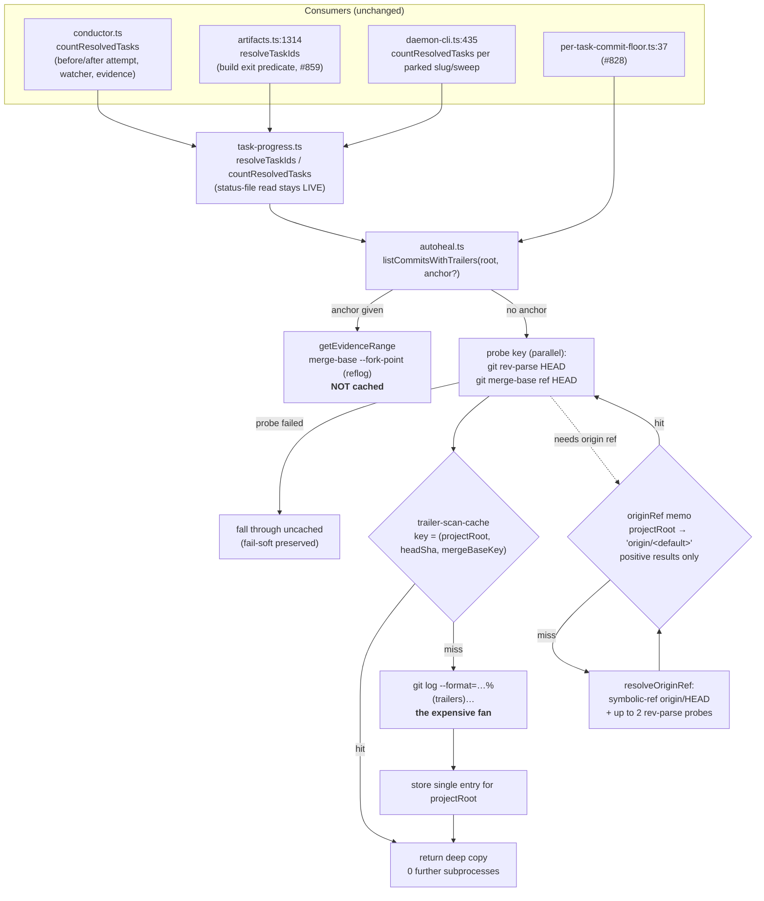

# Architecture: trailer-scan memoization seam

Source issue: jstoup111/ai-conductor#878 · Track: technical · Tier: M

## Where the seam sits

The cache is introduced at exactly one place — inside `listCommitsWithTrailers`, on the
**no-anchor** branch only. Every consumer above it is unchanged and unaware.

## Subprocess accounting

| Path | symbolic-ref / probes | rev-parse HEAD | merge-base | git log | total |
| --- | --- | --- | --- | --- | --- |
| Today, every call | 1–3 | 0 | 1 | 1 | **3–5** |
| New, cold (first call per root) | 1–3 | 1 | 1 | 1 | 4–6 |
| New, warm + unchanged HEAD | 0 | 1 | 1 | 0 | **2** (issued in parallel ⇒ one latency round) |
| New, warm + HEAD moved | 0 | 1 | 1 | 1 | 3 |

The two warm-path calls are `git rev-parse` and `git merge-base` — pure ref plumbing,
issued concurrently via `Promise.all`. The eliminated `git log --format=…%(trailers)…`
is the dominant cost (it expands full commit messages for up to 100 commits).

**Deviation from the issue's stated observable.** #878 asks for "~1" subprocess on the
repeat. This design delivers **2**, deliberately: the third possible key —
`(headSha, defaultRefTipSha)`, obtainable in one `git rev-parse HEAD <ref>` — would
require assuming `merge-base` is a pure function of its two tip shas, which is false for
shallow clones (`--deepen` moves the graft boundary), `git replace` refs, and grafts.
Two cheap plumbing calls buy an unconditional freshness proof. The issue's own hard
constraint ("no staleness — a HEAD or merge-base change is always observed on the next
call") outranks its illustrative subprocess count. See the ADR.

## Cache lifetime and bounding

- **Scope:** module-level, per Node process. Not persisted, not shared across processes.
- **Shape:** `Map<projectRoot, { headSha, mergeBaseKey, commits }>` — **one entry per
  project root**, overwritten on change. It cannot grow with commit history.
- **Bound:** number of distinct project roots the process touches. In the daemon that is
  the slug worktree count; capped by a small LRU eviction (64) so a long-lived daemon
  that churns worktrees cannot leak.
- **Reset:** `resetTrailerScanCaches()` exported for tests and any future explicit
  invalidation need.

## Invariants the design must preserve

1. `countResolvedTasks` / `resolveTaskIds` return values are identical to pre-change for
   every input, including error inputs.
2. `.pipeline/task-status.json` is never cached — it is re-read on every call.
3. A cache entry is only ever written after a **successful** scan whose key was
   successfully probed.
4. No consumer receives an object graph another consumer can mutate.
