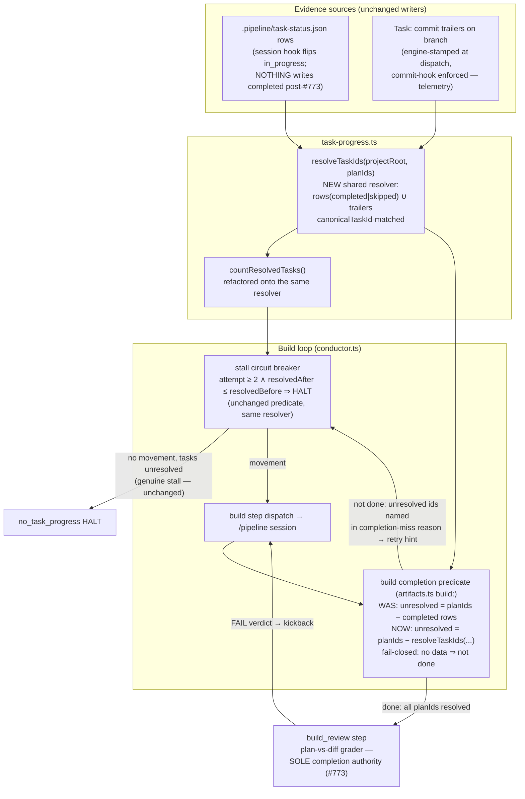
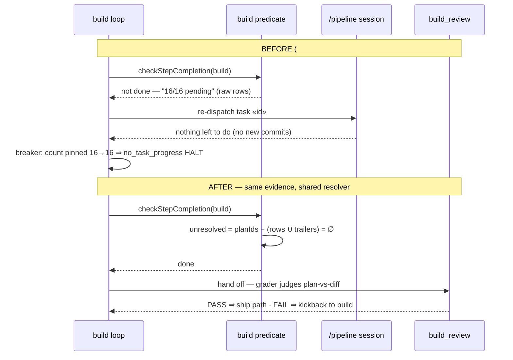

# Architecture — Trailer-union build completion (fix false `no_task_progress` halt at 100%)

**Stem:** `trailer-union-build-completion` · Tier M (lightweight diagram) · 2026-07-23 · Refs #859

One shared **task-resolution definition** — `resolved = status rows (completed|skipped) ∪
Task: commit trailers (canonical-id matched)` — is extracted into `task-progress.ts` and
consumed by BOTH build-loop consumers that previously disagreed:

- the **build completion predicate** (`artifacts.ts` `build:`) — previously raw rows only,
  structurally unsatisfiable post-#773 (nothing flips rows to `completed` anymore);
- the **stall circuit breaker** (`conductor.ts`) — already trailer-union via
  `countResolvedTasks`, saturating at the ceiling.

Trailers become **non-authoritative routing telemetry**: they decide WHEN the build step
hands off to `build_review`; `build_review`'s plan-vs-diff grader remains the SOLE
completion authority (#773). Genuine-stall behavior is unchanged.

## Component / dataflow (C4 component level)

## Sequence — the #859 failure vs. target state

## Key architectural decisions (see ADR)

1. **One resolution definition, two consumers.** The exit gate and the stall breaker can
   never disagree again — both call the same `resolveTaskIds` fold. The breaker's stall
   predicate itself (`attempt ≥ 2 ∧ no movement`) is untouched.
2. **Routing vs. authority.** Trailers route the build→build_review handoff; they never
   assert completion. `build_review` can still FAIL a fully-trailered build and kick back
   (#773 preserved). This refines — does not reverse — "trailers are telemetry only".
3. **Rows stay dead.** No machinery writes `completed` rows; no revival of the deleted
   derivation engine (`deriveCompletion`, #773 Task 11). Rows still count when present
   (operator/recovery edits, `skipped` markers) — the union only widens resolution.
4. **Fail-closed gate, fail-soft telemetry.** The predicate keeps "no data ⇒ not done"
   (missing/corrupt task-status.json, unreadable plan). Trailer reads inside the resolver
   stay fail-soft (git error ⇒ no extra ids) — degrading to today's row-only behavior,
   never to a false `done`.
5. **Worktree-loss resilience.** Trailer evidence is branch-derived, so a recreated
   worktree (rows lost) no longer false-stalls on already-committed work (#497 class).

## Touched modules

- `src/conductor/src/engine/task-progress.ts` — NEW `resolveTaskIds` (extracted from
  `countResolvedTasks`); `countResolvedTasks` refactored onto it
- `src/conductor/src/engine/artifacts.ts` — `build:` predicate consumes the resolver
- `src/conductor/src/engine/conductor.ts` — stall-breaker call sites unchanged in
  behavior; comment/wiring updated to the shared resolver
- `skills/pipeline/SKILL.md` — correct the stale "engine derives completion" contract
  text (trailers route the handoff; build_review judges completion)
- Docs: `CHANGELOG.md`, `src/conductor/README.md`, `docs/daemon-operations.md`
  (stall/halt semantics note)
