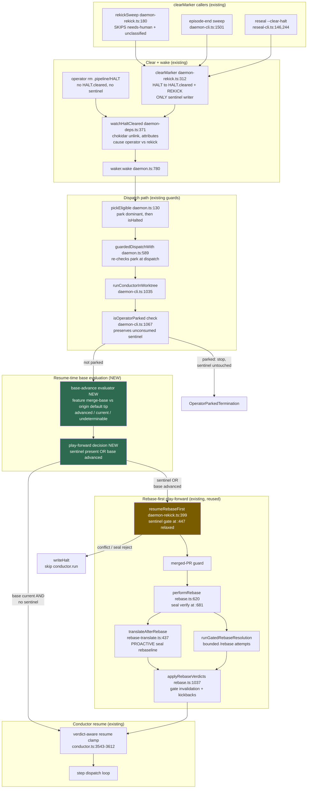
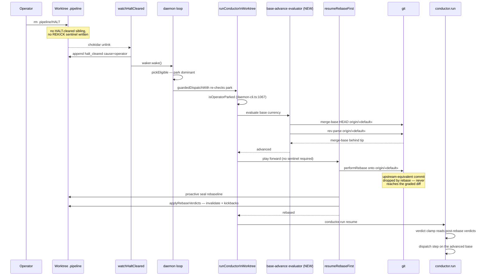
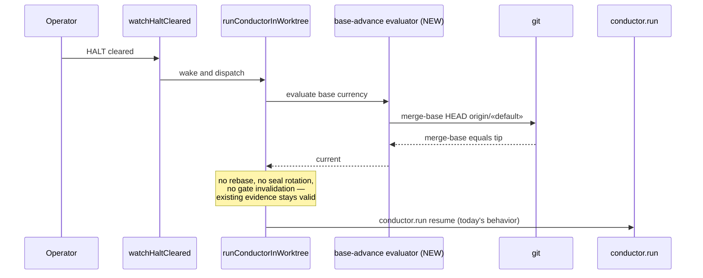

# Components: Base-Advance Evaluation on Halt Resume (#1245)

**Last updated:** 2026-08-11
**Scope:** The daemon's halt-resume seam — what happens between an operator clearing
`.pipeline/HALT` and the conductor dispatching a step. Covers where base-advance evaluation
is inserted relative to the halt-cleared wake, the park guards, the one-shot `.pipeline/REKICK`
sentinel, the `resumeRebaseFirst` play-forward, and the verdict-aware resume clamp.

## Problem this addresses

The rebase-first play-forward is reachable **only** through the `.pipeline/REKICK` sentinel,
and `clearMarker` (`daemon-rekick.ts:312-326`) is its only writer. `rekickSweep` — one of
`clearMarker`'s three callers — refuses halts classed `needs-human` or `unclassified` on every
sweep (`daemon-rekick.ts:180-193`), so those classes can never arm the sentinel. An operator
clearing such a halt by hand (`rm .pipeline/HALT`) reaches no caller at all: no `HALT.cleared`
sibling, no sentinel. `resumeRebaseFirst` then returns `'skipped'` at its first line
(`daemon-rekick.ts:447-448`) and the feature resumes against whatever base its worktree
already had.

## Diagram

## Legend

- **Green nodes** — the only new elements: a per-feature base-advance evaluator and the
  decision that consumes it. Nothing else in the graph is new.
- **Amber node** — `resumeRebaseFirst`, existing and reused whole; the single change is that
  its sentinel short-circuit (`daemon-rekick.ts:447-448`) is no longer the only way in. Its
  body — merged-PR guard, rebase, seal handling, gated resolution, verdict application — is
  untouched.
- **Grey nodes** — existing components, unchanged.
- **Placement is load-bearing.** The evaluator sits *after* the `isOperatorParked` check at
  `daemon-cli.ts:1067` and *before* `resumeRebaseFirst`. Park therefore keeps strict
  precedence, and a parked worktree's unconsumed sentinel is still never touched. It sits
  before `conductor.run()` so the verdict clamp reads the verdicts
  `applyRebaseVerdicts` just wrote, rather than pre-rebase ones.
- **Why the seal needs no separate work.** `performRebase` verifies the seal before moving
  HEAD (`rebase.ts:681-698`), and `translateAfterRebase` rotates it in the same operation
  with trigger `proactive-rebase` (`rebase-translate.ts:437-476`). Routing through the
  existing play-forward is what delivers "no manual reseal" — no new authorization channel
  is introduced.

## Sequence: operator clears a needs-human HALT after main advanced

## Sequence: base has not advanced (the no-op path)

## Change Log

| Date | Change | Reason |
|------|--------|--------|
| 2026-08-11 | Initial generation | DECIDE for #1245 — halt resume must evaluate an advanced base before dispatching a judged gate |
