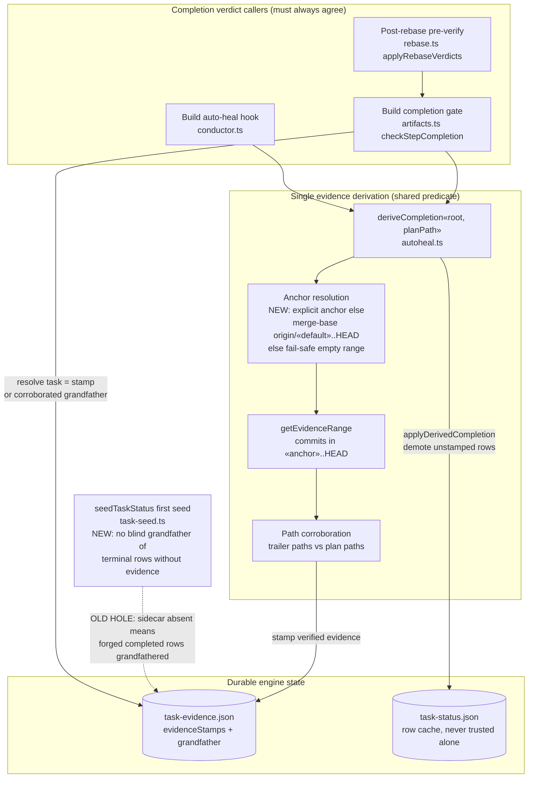
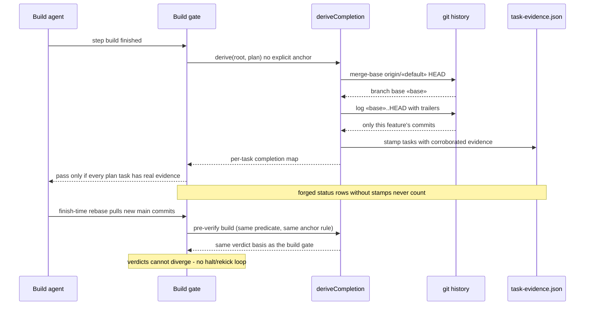

# Components: Unified Build-Completion Evidence Derivation (#456 + #463)

**Last updated:** 2026-07-10
**Scope:** The evidence-derivation seam — anchor resolution in `deriveCompletion`
(autoheal.ts), the build completion gate and auto-heal hook (artifacts.ts /
conductor.ts), the post-rebase pre-verify (rebase.ts), and the task-seed
migration-grandfather path (task-seed.ts) with the `.pipeline/task-evidence.json`
sidecar.

## Diagram



## Legend

- **Callers** — the three places a task-completion verdict is computed. Bug #463 is the
  guarantee that these can never disagree: they all flow through the same derivation with
  the same anchor.
- **Anchor resolution** — bug #456: the old no-anchor fallback resolved to the repo genesis
  commit (`git log --reverse HEAD | head -1`), making the evidence range span the entire
  history; the fix resolves the branch base via `merge-base` against the derived origin
  default branch (mirroring `listCommits`), with a fail-closed empty range (nothing
  completes, anomaly logged) when no base is derivable — never the whole history.
- **NEW / OLD HOLE** annotations — the two behavior changes this feature makes; everything
  else is the existing seam.
- `«…»` — placeholder for a variable value.

## Change Log

| Date | Change | Reason |
|------|--------|--------|
| 2026-07-10 | Initial generation | DECIDE phase for #456 + #463 spec |
```

# Sequence: corrected completion verdict across build → rebase → pre-verify


