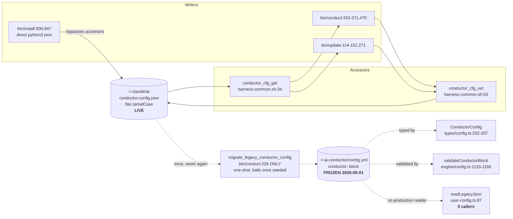
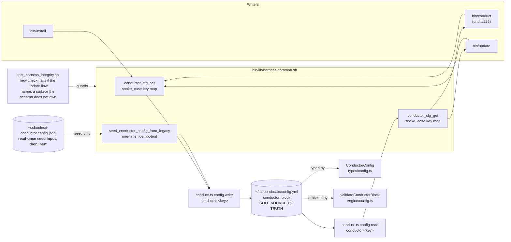
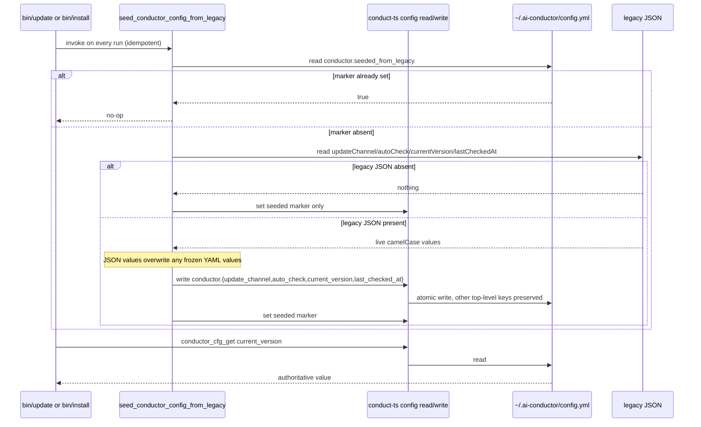

# Architecture: Update-check config single source of truth

**Last updated:** 2026-08-09
**Scope:** Repoint every reader and writer of update-check state from the legacy
`~/.claude/ai-conductor.config.json` onto the schema-owned `conductor:` block in
`~/.ai-conductor/config.yml`, with a one-time seed migration and no PyYAML dependency.

## Current state (the defect)

**The defect is not two competing sources.** It is one live source (the JSON) plus a
write-once-then-frozen snapshot (the YAML) that is typed, schema-validated, and documented but has
**zero production readers**. `migrate_legacy_conductor_config` runs only from `bin/conduct` — which
[#226](https://github.com/jstoup111/ai-conductor/issues/226) will delete — and short-circuits once
`conductor.current_version` is non-empty, so it never reconciles again.

## Target state

## Seed-migration sequence

The operator-decided rule: **seed the YAML from the live JSON once, then the YAML is authoritative
forever.** The JSON is the only file anything has written since 2026-05-01, so it — not the frozen
YAML — reflects real behavior. A pure YAML-wins reconciliation would revert an operator's channel
and roll `current_version` back to a stale value, which `bin/update:133-138` then treats as
unverifiable, silently stopping update checks for good.

## Key mapping

| Legacy JSON key (flat, camelCase) | Schema-owned YAML path (snake_case) | Type |
|---|---|---|
| `updateChannel` | `conductor.update_channel` | `'tagged' \| 'main'` |
| `autoCheck` | `conductor.auto_check` | boolean |
| `currentVersion` | `conductor.current_version` | string |
| `lastCheckedAt` | `conductor.last_checked_at` | string |

`validateConductorBlock` (`engine/config.ts:1136`) rejects unknown keys in the block, so the
one-time seed marker must be an allowed key added to both `ConductorConfig` and the validator's
`allowed` set — or held outside the block. Resolved by ADR-002.

## No PyYAML dependency

Bash never parses YAML. `conductor_cfg_get`/`conductor_cfg_set` delegate to
`conduct-ts config read` / `conduct-ts config write`, which use `js-yaml`. This is an established
precedent, not a new pattern: `bin/install` already delegates its `markdown_viewer` and
`mermaid_renderer` reads/writes to these commands, "replacing its earlier direct PyYAML
reads/writes" (`docs/reference/cli.md:520-521`). `config read` already accepts an arbitrary dotted
path; `config write` is currently restricted to `markdown_viewer|mermaid_renderer` and must be
extended to accept the `conductor` block.

The failure mode this avoids is specific and severe: `harness_cfg_get`
(`harness-common.sh:79-82`) **silently returns the caller's default** when PyYAML is missing. Wiring
the update flow through it would make a PyYAML-less install read `current_version=""`, which
`bin/update:133-138` reports as *"Installed tagged release is unverifiable"* and then stops checking
— permanently and silently.

## Legend

- The legacy JSON is demoted to a read-once seed input. It is never written again and never read
  after the seed marker is set. It is left on disk as a backup, not deleted.
- Every bash read and write of update-check state passes through `conduct-ts config read/write`, so
  the schema-owned YAML is the only file the update flow can touch.
- A new `test/test_harness_integrity.sh` check fails closed if the update flow names a config
  surface the schema does not own, so the split cannot silently reappear (issue outcome #4).
- `readLegacyJson()` (`user-config.ts:87-106`) is removed as dead code; its translation
  responsibility moves into the bash seed path, which is where the only remaining legacy reader
  lives.
- `bin/conduct` retains its duplicated block only until #226 deletes it; the seed function and the
  accessors live in `bin/lib/harness-common.sh`, the designated permanent home
  (`bin/update:12-14`), so nothing is lost when `bin/conduct` goes.

## Change Log

| Date | Change | Reason |
|---|---|---|
| 2026-08-09 | Initial diagrams: current defect, target wiring, seed-migration sequence. | Issue #1400 — establish that the YAML block has zero production readers before proposing the repoint. |
