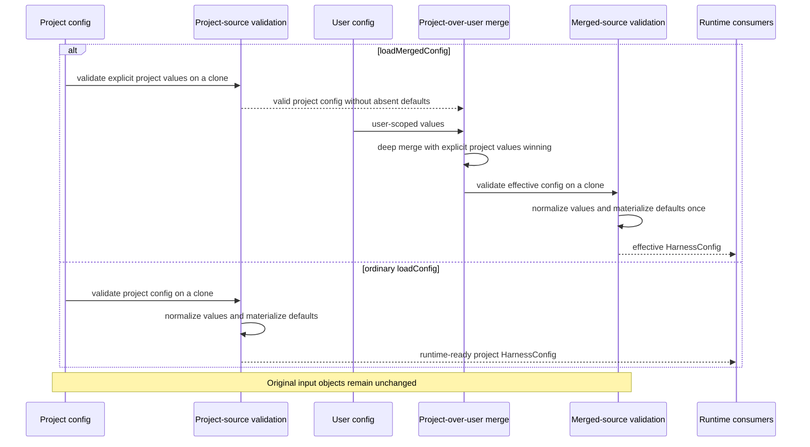

# Sequence: User-level configuration precedence

**Last updated:** 2026-07-30
**Scope:** Pure project validation followed by user-under-project merge and one effective-config normalization pass.

## Diagram

## Legend

- Project-source validation retains source-specific guards while omitting defaults for absent keys.
- Explicit project values continue to override matching user values under the established deep-merge contract.
- Merged-source validation is the single point that normalizes values and materializes runtime defaults.
- Ordinary project-only loading retains its existing runtime-ready defaults; deferred defaults are exclusive to the merged-loading pre-pass.
- Validation operates on clones, so caller-owned project, user, and merged inputs are not mutated.

## Change Log

| Date | Change | Reason |
|---|---|---|
| 2026-07-30 | Added the plan's ordinary `loadConfig` compatibility branch. | Make the source-aware validation wiring and project-only safeguard explicit before implementation. |
| 2026-07-30 | Added effective-config normalization sequence. | Restore user-level precedence for issue #1000 without weakening project policy. |
