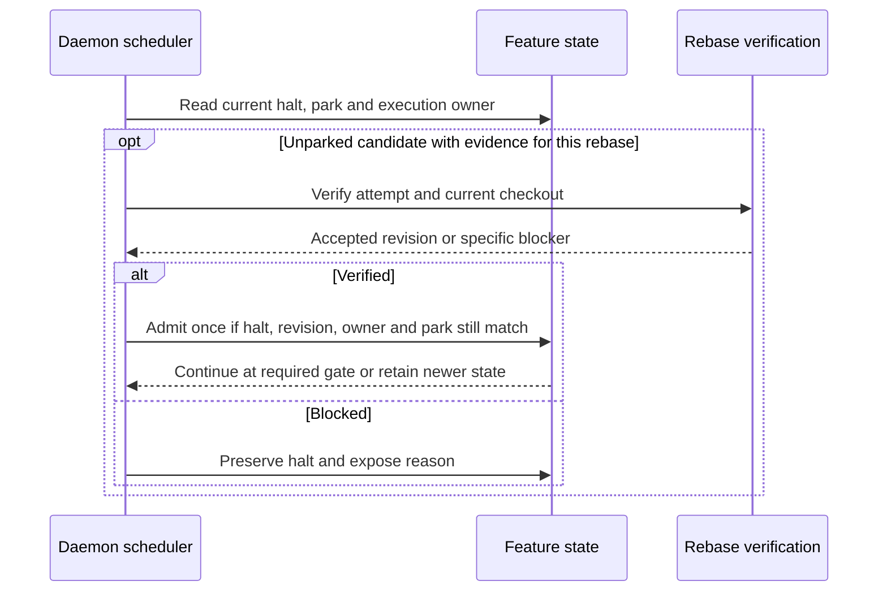

# Verified rebase recovery

Operator-approved dispatch sequence for the [approved requirements](../specs/2026-11-19-prevent-avoidable-operator-cleanup-after-verified-.md).

```mermaid
sequenceDiagram
    participant D as Daemon scheduler
    participant S as Feature state
    participant R as Rebase verification
    D->>S: Read current halt, park and execution owner
    opt Unparked candidate with evidence for this rebase
        D->>R: Verify attempt and current checkout
        R-->>D: Accepted revision or specific blocker
        alt Verified
            D->>S: Admit once if halt, revision, owner and park still match
            S-->>D: Continue at required gate or retain newer state
        else Blocked
            D->>S: Preserve halt and expose reason
        end
    end
```
