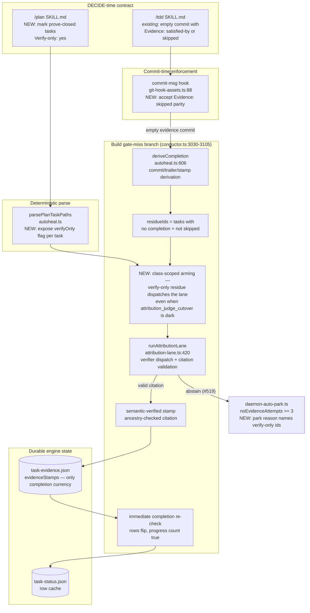

# Components: Verify-Only (Prove-Closed) Task Evidence Closure (#677)

**Last updated:** 2026-07-17
**Scope:** The completion-evidence seam for tasks that legitimately produce no code delta —
plan-task marker parsing (autoheal.ts `parsePlanTaskPaths`), the gate-miss judged attribution
lane (attribution-lane.ts, conductor.ts:3030-3105), the evidence sidecar
(`.pipeline/task-evidence.json`), the generated commit-msg hook (git-hook-assets.ts), and the
/plan + /tdd skill contracts.

## Diagram

## Component Notes

- **No new subsystem.** Every box marked NEW is an extension of an existing seam: the marker
  rides the existing plan-task grammar; the arming predicate wraps the existing lane gate;
  the hook change adds one accepted trailer form already accepted by autoheal.
- **Completion currency is unchanged** (#463): evidence stamps in `task-evidence.json` remain
  the only thing the gate accepts. The evaluator's batch APPROVE is still never trusted as
  completion; the judge's citation-validated stamp is the sanctioned semantic lane (#520).
- **Failure direction is unchanged**: a verify-only task the judge cannot substantiate abstains
  loudly (#519) into the retry hint and, at budget, the existing auto-park — now with the
  verify-only task ids named in the park reason.
