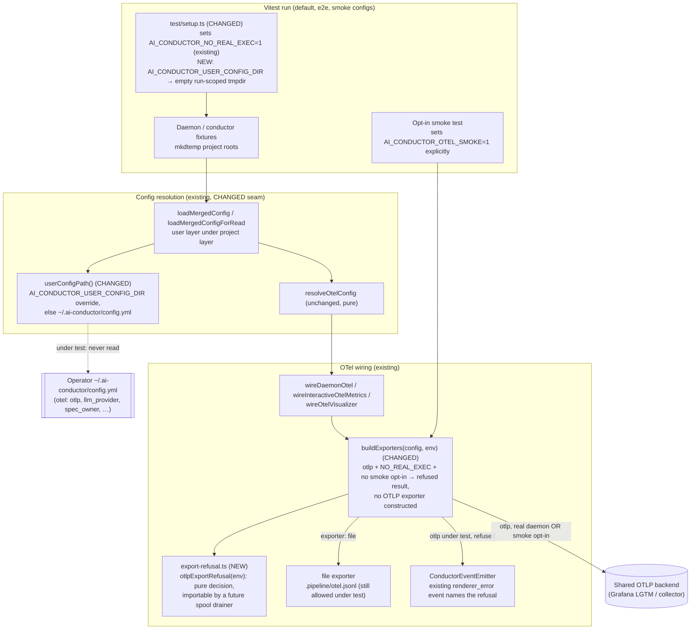

# Components: Test-run isolation from operator OTel export

**Last updated:** 2026-10-03
**Scope:** How an ordinary Vitest run (unit, integration, acceptance, e2e) is kept away from the
operator's user-level config and from any shared OTLP backend. It covers two seams: the user-config
location (`src/engine/user-config.ts`) and the single OTLP exporter construction point
(`buildExporters` in `src/engine/otel/transport.ts`). Real daemon export is unchanged.

## Diagram

## Legend

- **CHANGED**: an existing component whose behavior changes in this feature. Everything else exists
  and is unchanged.
- Dotted edge: the path the feature severs. Under test, the operator's user config is never read.
- `AI_CONDUCTOR_NO_REAL_EXEC=1` is the suite's existing kill-switch marker (`test/setup.ts`; it is
  consumed by `daemon-tmux.ts` and `ci-fix.ts`). It is reused here as the "under test" signal rather
  than adding a parallel marker.
- `AI_CONDUCTOR_OTEL_SMOKE=1` is the explicit opt-in. Only tests under the smoke tier, which is
  excluded from default verification, may set it.
- The refusal is reported through the existing `renderer_error` event on the spine. No new channel
  is added.
- Wiring entry points accept an optional `env` (default `process.env`) so a test can drive a real
  exporter against a loopback receiver it owns without mutating the process environment.

## Change Log

| Date | Change | Reason |
|------|--------|--------|
| 2026-10-03 | Initial generation | #2471: Vitest daemon fixtures leak into shared OTel metrics |
| 2026-10-03 | Plan update: added the `export-refusal.ts` decision module and the injectable `env` on `buildExporters` and the wiring contexts | `/plan` for #2471; conflict-check resolution option 1 |
