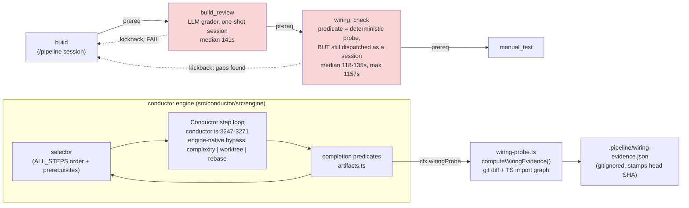
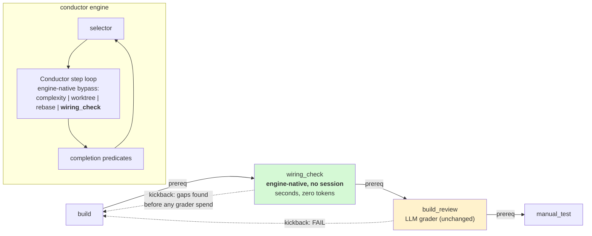
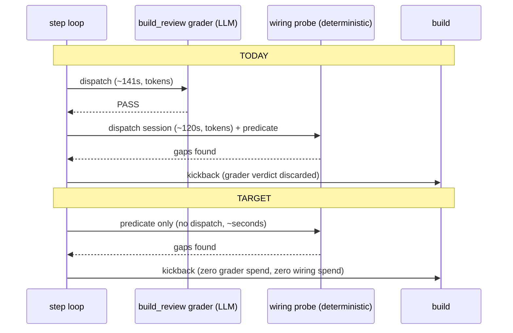

# Architecture: cheap-gate-first BUILD tail (#879)

**Date:** 2026-07-23
**Scope:** BUILD-phase gate topology + conductor step dispatch. C4 Level 3 (component).

## C3 — Component view: BUILD tail, today

Two defects are visible in this view:

1. **`wiring_check` is dispatched.** Its `StepDefinition` carries no `skillName`, its
   `STEP_PROMPTS` entry is documented as a display sentinel, and its verdict is computed by
   `PRED` via `ctx.wiringProbe` — yet `DISPATCH`'s bypass list omits it, so the engine spawns
   a session on the `/conduct wiring-check` prompt before the predicate ever runs. That
   session can commit, which moves HEAD and invalidates the head-stamped evidence
   (22 observed `is stale` retries).
2. **The expensive gate is upstream of the cheap one.** `BR` is unconditionally paid before
   `WC` can speak, so a wiring-broken HEAD always buys a grader verdict it then discards.

## C3 — Component view: target

## Sequence — wiring-broken HEAD, before vs after

## Invariants preserved

- Step **state keys and linear indices** are per-step-name; swapping two adjacent entries in
  `ALL_STEPS` changes their indices but not the key namespace or any group membership.
- `VALIDATION_GROUP` members are `manual_test, prd_audit, architecture_review_as_built`
  (`steps.ts:310-313`). Neither reordered step is a member, and no runtime contiguity/anchor
  assertion exists (`getGroupForStep` is a plain map lookup) — so group engagement,
  `resolveGroupMembership`, and the width-1 degrade are untouched.
- `GATE_SURFACE` (`gate-invalidation.ts:44-52`) is a keyed record, order-free — the
  preserve/invalidate classification is unchanged by the swap.
- Both gates remain `enforcement: 'gating'`, `loopGate: true`, `phase: 'BUILD'`,
  `skippableForTiers: []`, and both remain strictly between `build` and `manual_test`.
