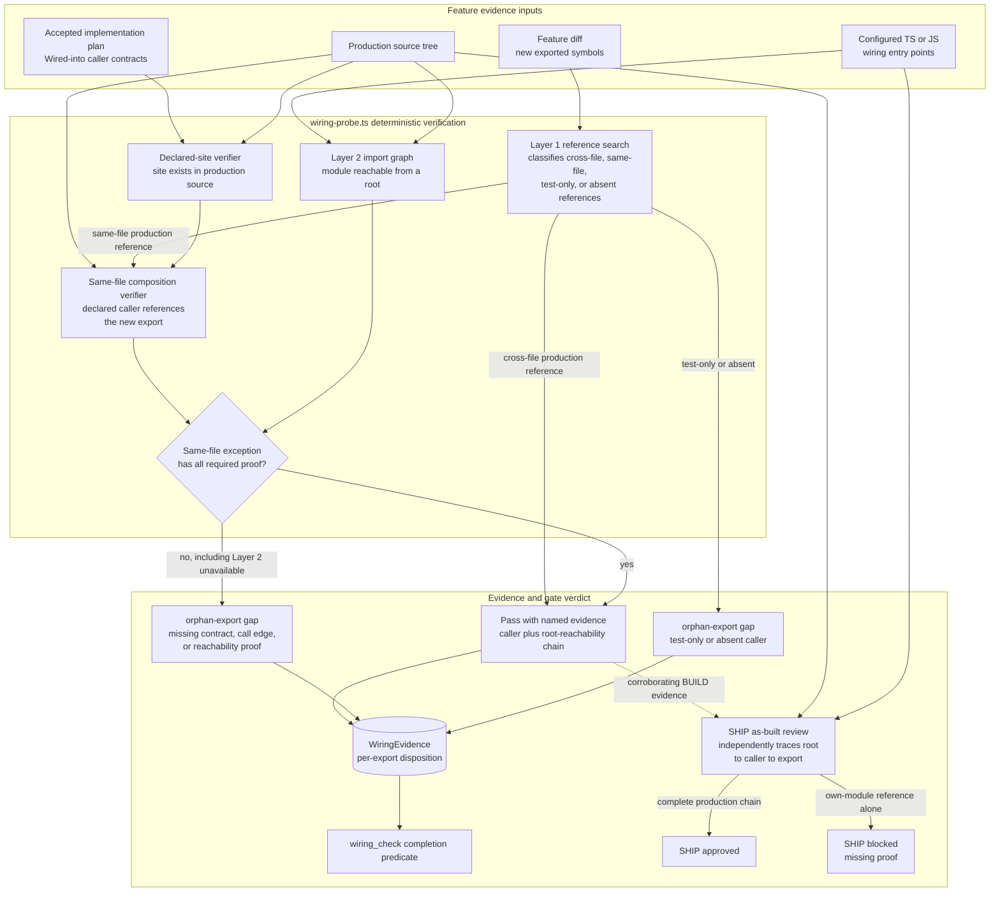

# Components: Contract-aware same-file wiring verification

**Last updated:** 2026-07-30
**Scope:** Refinement of the wiring-reachability gate for exported helpers called inside their defining module.

## Diagram

## Legend

- The existing cross-file Layer 1 success path remains unchanged.
- A same-file-only export receives a narrow exception only when the accepted plan declares its caller, production source proves that caller references the new export, and configured Layer 2 proves the defining module is reachable from a production root.
- Missing or inapplicable Layer 2 proof fails closed for the exception. Non-TypeScript/JavaScript projects retain the current same-file gap until a language-specific reachability adapter exists.
- Test-only and genuinely absent references remain gaps. Evidence names the export, declared caller, and reachability result so a failed build is actionable.
- The SHIP-time as-built review independently traces the same production-root-to-caller-to-export chain. An own-module caller counts only inside that complete chain; an own-module reference by itself remains blocking.

## Change Log

| Date | Change | Reason |
|------|--------|--------|
| 2026-07-30 | Initial generation | DECIDE phase for issue #880 |
| 2026-07-30 | Plan update | Sequenced typed proof validation, shared TypeScript analysis, exact symbol identity, boundary acceptance, and SHIP contract alignment |
