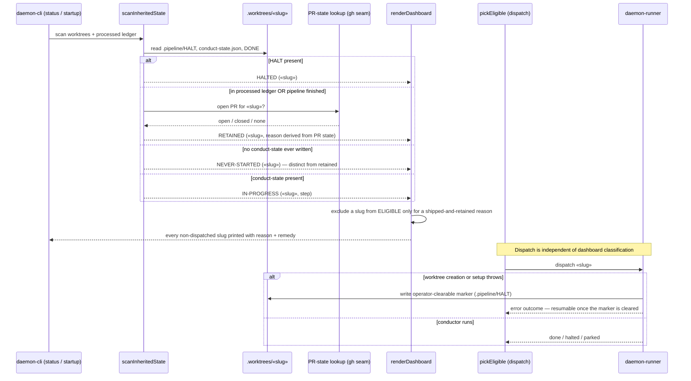

# Sequence: Worktree classification and dispatch-exclusion reporting

**Last updated:** 2026-08-05
**Scope:** How a feature worktree is classified for the operator dashboard, how a retained
row's reason is established, and how an errored dispatch leaves an operator-clearable lever.

## Diagram

## Legend

- **NEVER-STARTED** is a new presentation bucket: a worktree that has never written
  `.pipeline/conduct-state.json`. It is reported separately from a retained ship and is
  **not** excluded from ELIGIBLE.
- **RETAINED** keeps its dispatch exclusion, but its reason is now derived from an actual
  PR-state lookup rather than a hardcoded string; a row may only claim a PR is awaiting
  main when an open PR for that slug exists.
- The **PR-state lookup** reuses the existing `gh` seam already injected into
  `daemon-cli`; a lookup failure degrades to an explicitly unknown reason, never to a
  false `pr-open-awaiting-main` claim.
- `pickEligible` never consults dashboard classification — the dashboard is observational.
  The dispatch-side change is the guarantee that **no** error path returns without leaving
  an operator-clearable marker, including when worktree creation itself throws before a
  worktree handle exists.

## Change Log

| Date | Change | Reason |
|---|---|---|
| 2026-08-05 | Initial diagram for the classification + exclusion-reporting change. | Make the classification branches, the derived retained reason, and the dispatch-side lever guarantee explicit before implementation (#1329). |
