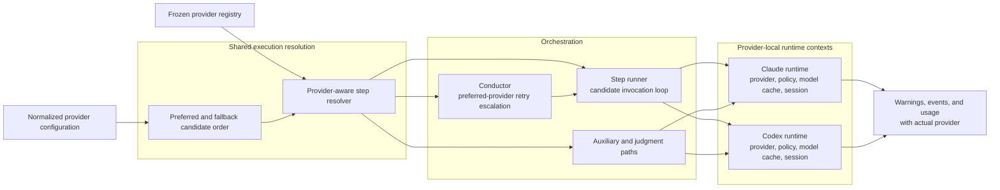

# ADR: Provider-aware step execution with provider-local runtime state

**Date:** 2026-07-24
**Status:** SUPERSEDED by
`adr-2026-07-24-provider-aware-step-execution-fresh-session-scope`
**Supersedes:** adr-2026-07-23-provider-policies-with-deeper-discovery-effort
**Deciders:** James Stoup (operator), architecture review for issue #927

> **Correction:** The originally approved text incorrectly implied that a
> provider session persisted across later steps. Accepted issue #325 and the
> implementation reset sessions at every step boundary. Session statements in
> this superseded ADR are corrected below to avoid reviving the stale
> one-session-per-feature model; the superseding ADR is authoritative.

## Context

The built-in Claude and Codex integrations and their provider-native model
policies are registered before a conductor run begins. The interactive and daemon
composition roots currently select one provider instance and one model policy,
then pass that pair through the complete run.

That run-global narrowing is present in more than the primary step dispatch:
the conductor resolves retry escalation from one policy, the runner owns one
provider and one model-availability cache, and its mutable session slot is reset
at each step boundary. Auxiliary review, attribution, recovery, and prelude paths
use the same provider directly. Adding only a provider field to step configuration would
therefore route some invocations while still leaking the original provider's
models, sessions, availability state, or usage attribution.

The approved PRD requires:

- a scalar or ordered provider list, with the first provider inherited;
- explicit per-step specialization using the same provider-selection concept;
- selected-provider-first fallback through every other configured provider;
- fallback-provider native defaults instead of carrying native settings across;
- no provider fallback for authentication, rate limiting, session expiry, or
  ordinary step failure;
- cross-provider fallback after within-provider model exhaustion;
- per-step reconsideration except for deterministic run-wide unavailability;
- fail-closed validation for unknown provider names; and
- full mixed-provider guarantees for built-in providers. Custom provider plugins
  retain their existing compatibility behavior; a new custom-provider policy
  contract is out of scope.

The approved
`adr-2026-07-23-provider-policies-with-deeper-discovery-effort` established
provider-native policy tables but binds one policy to a whole run. This decision
must preserve its model tables, effort values, escalation orders, fallback
ladders, explicit-override intent, and custom-provider compatibility while
replacing the run-global selection boundary.

## Options Considered

### Option A: Shared provider-aware execution resolver and provider-local runtimes

Normalize provider configuration once, resolve the preferred provider for each
step, and keep a runtime context per built-in provider. The conductor and every
runner/auxiliary path use the same resolver. A provider runtime owns the provider
instance, model policy, model-availability cache, and provider-native session
state.

- **Pros:** Provider identity and native state move together; one resolution seam
  serves interactive, daemon, grouped, recovery, and judgment paths; fallback can
  re-resolve native defaults without leaking primary-provider settings; actual
  provider attribution is explicit and testable.
- **Cons:** Requires replacing direct provider/policy access across several core
  modules; within-step session state becomes step-and-provider-scoped; the
  resolver contract is broader than today's model-only resolver.

### Option B: One complete step runner per provider

Construct a runner for every configured provider and route each step to a runner.

- **Pros:** Existing runner internals remain mostly provider-local; sessions and
  model caches are naturally isolated.
- **Cons:** Duplicates runner lifecycle and counters; fallback crosses runner
  boundaries; conductor escalation and auxiliary paths still need a shared routing
  decision; hooks, events, and usage can be double-counted or attributed to the
  wrong runner.

### Option C: Composite provider implementing the current provider interface

Keep one runner and inject a multiplexer that delegates each invocation to another
provider.

- **Pros:** Smallest constructor change at composition roots.
- **Cons:** Provider choice is hidden below step resolution; the conductor still
  resolves model and effort from one policy; provider-native session and model
  state remain mixed; fallback diagnostics and actual-provider attribution become
  transport side effects instead of resolved execution data.

## Decision

Choose **Option A**.

### 1. Configuration normalization and validation

The run-level provider selection accepts either a string or a non-empty ordered
array of strings. Omitted selection normalizes to `["claude"]`; a scalar
normalizes to a one-item array. Empty arrays, empty names, and duplicate names are
configuration errors rather than silently repaired.

Individual steps may name one preferred provider. Provider selection is not added
to phase or global-default bags. A step preference may name a registered built-in
provider even when that provider is absent from the run-level array.

After external discovery and built-in registration are complete, but before any
executable step dispatches, validate every normalized run-level and executable
step provider name against the frozen registry. Unknown names fail with the
provider name, step or run scope, and available registered names.

The candidate order for a step is:

1. its explicit provider, when present, otherwise the first run-level provider;
2. every run-level provider in declared order, excluding the preferred provider
   and any duplicate already attempted.

This makes an explicit later provider fall back to earlier configured providers
without making the array an allowlist.

### 2. Shared provider execution resolver

Introduce one provider-aware execution resolver used by both the conductor and
the step runner. It resolves:

- provider-neutral step behavior once: retries, review mode, skill, hooks,
  disabled state, and escalation enablement;
- the preferred provider key and ordered fallback candidates;
- the preferred provider's model policy and primary model/effort settings; and
- a named provider runtime for invocation.

The preferred provider keeps existing explicit model and effort precedence.
Model and effort values co-located with an explicit step provider belong to that
provider. Existing run-wide model configuration belongs to the inherited first
provider and must not leak into a specialized provider.

On cross-provider fallback, resolve the fallback provider's per-step/tier policy
defaults and default model ladder. Do not carry the preferred provider's explicit
model, effort, CLI overrides, configured model ladder, retry-escalated model, or
availability cache into the fallback provider. Provider-neutral settings and the
current step attempt remain unchanged, so a provider fallback does not consume a
retry.

The conductor asks this shared resolver for the preferred provider's base config
and policy when computing retry escalation. It no longer owns one run-global model
policy. The runner uses the same resolver, preventing conductor/runner disagreement.

### 3. Provider-local runtime context

Maintain one runtime context per built-in provider key containing:

- the registered provider instance;
- the provider's existing model policy;
- a model-availability cache constructed from that provider's ladder; and
- step-and-provider-scoped session identity and created/resume state.

Each provider attempted in a step receives isolated session state so a Claude
session is never resumed as a Codex session or vice versa. All provider sessions
are discarded at the next step boundary; only retries within the same step and
provider may resume. The scalar path retains that accepted #325 behavior.
Multi-provider state preserves one overall run identity for observability without
preserving conversation context across steps.

Concurrent branch sessions remain branch-local and provider-local. One branch may
not mutate another branch's or the main conductor's provider session marker.

### 4. Availability classification and fallback

The existing within-provider model ladder remains the first recovery layer. Each
provider runtime consults and updates only its own model cache.

Invocation results gain an explicit provider-unavailable classification for a
built-in provider that cannot start or is deterministically unusable. Missing
provider executables are run-wide unavailable and may be cached for the remainder
of the run.

If the final result after a provider's model ladder still reports model
unavailability, treat that provider as unavailable for the current step attempt
and try the next provider. Model exhaustion does not mark the provider globally
dead; a later step resolves and tries it again.

Authentication failures, rate limits, session expiry, timeouts, rejected work, and
ordinary non-zero results return to their existing recovery paths immediately.
They never advance the provider candidate list.

Every provider transition emits a structured and human-visible warning containing
step, failed provider, reason, and next provider. Final exhaustion reports every
provider attempted and its reason.

### 5. Interactive and auxiliary execution

Built-in interactive invocations must return enough classified completion data for
the runner to apply the same availability rules while retaining visible streaming
output. The provider interface may add backward-compatible optional result data;
custom plugins that use the legacy contract retain their current compatibility
behavior and are not promised cross-provider fallback by this ADR.

All direct production dispatches route through the shared resolver/runtime context,
including:

- normal interactive and autonomous steps;
- concurrent validation branches;
- build review and attribution verification;
- complexity assessment and project prelude;
- rebase, remediation, setup-fix, CI-fix, and recovery invocations; and
- inline and daemon composition roots.

No production path may retain a captured run-global provider or model policy.

### 6. Provider-attributed results and usage

Resolved and completed step data carry the preferred and actual provider keys.
Token usage, retries, session diagnostics, warnings, and emitted events are
attributed to the provider that produced each attempt. Cross-provider fallback
starts a fresh session for that provider and step and never resumes the failed
provider's session.

### 7. Preserved predecessor policy decisions

This ADR supersedes
`adr-2026-07-23-provider-policies-with-deeper-discovery-effort` only because its
run-global selection boundary is replaced. The following decisions remain in
force:

- independent built-in Claude and Codex per-step model tables;
- the existing Claude and Codex effort values, including high normal effort for
  explore/PRD and low S-tier explore;
- provider-native tier overrides, escalation order, and model fallback ladders;
- opaque explicit model identifiers with no cross-provider translation;
- provider-labelled generated documentation and Claude interactive skill pins;
  and
- warned Claude-compatible model policy for custom providers until a separate
  plugin-policy contract is approved.

## Proposed Component Flow

## Consequences

### Positive

- Provider selection, model policy, availability, session, and usage attribution
  share one boundary.
- Mixed Claude/Codex runs are deterministic and testable without translating
  provider-native model identifiers.
- Scalar configurations keep their established behavior.
- Provider fallback cannot silently consume retry budget or leak native settings.
- Auxiliary paths cannot bypass the same provider decision without an observable
  wiring gap.

### Negative

- Core constructors and test fixtures must move from one provider/policy to a
  resolver or runtime registry.
- Step-and-provider session ownership adds retry and crash-recovery coverage.
- Interactive built-in providers must expose classified completion results while
  continuing to stream output.
- Custom provider plugins do not receive the full fallback guarantee in this
  issue.
- A broad production wiring surface raises merge-conflict risk with concurrent
  conductor work.

### Follow-up Actions

- [ ] Add scalar/array and per-step provider configuration with fail-closed validation.
- [ ] Add shared provider-order and provider-aware step resolution primitives.
- [ ] Add provider-local runtime and model cache plus step-and-provider session state.
- [ ] Route normal, grouped, prelude, review, attribution, recovery, inline, and
      daemon paths through the shared resolver.
- [ ] Add built-in provider-unavailable and interactive result classification.
- [ ] Emit actual-provider events, warnings, diagnostics, and usage attribution.
- [ ] Preserve predecessor provider policies while replacing its run-global
      provider-selection boundary.
- [ ] Add mixed-provider, fallback, isolation, compatibility, and all-path wiring tests.
- [ ] Update configuration documentation, conductor documentation, generated model
      documentation if affected, and the Unreleased changelog.
