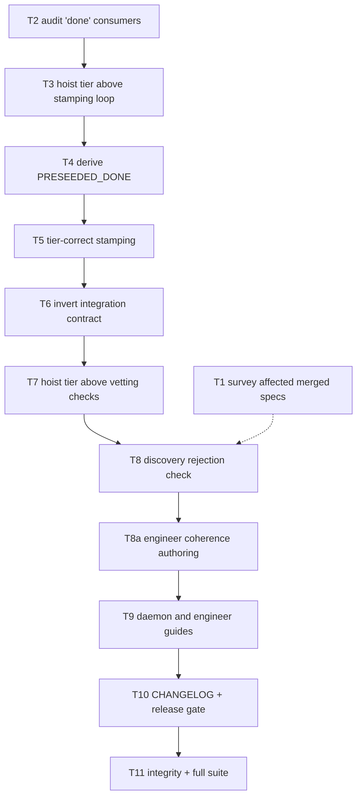

# Implementation Plan: DECIDE-phase coherence ownership at the daemon boundary (#971)

**Date:** 2026-07-26
**Tier:** M
**Track:** technical
**Stories:** `.docs/stories/2026-07-26-daemon-decide-phase-coherence-ownership-971.md`
**ADR:** `.docs/decisions/adr-2026-07-26-daemon-decide-preseed-ownership.md` (APPROVED)
**Conflict check:** `.docs/conflicts/2026-07-26-daemon-decide-phase-coherence-ownership-971.md` (PASSED)

## Executor orientation (zero-context)

The daemon pre-stamps "front half" (DECIDE) steps as already satisfied before the conductor
resumes, so an autonomous build starts at BUILD. That list, `PRESEEDED_DONE`
(`src/conductor/src/daemon-cli.ts:285-296`), is hand-written and omits `coherence_check` — the
only one of the nine `phase: 'DECIDE'` steps in `src/conductor/src/engine/steps.ts` that is
missing. Consequence: the daemon executes a DECIDE *authoring* step inside the build loop. This
is production-observed on eight features, and one M-tier run exhausted its retry budget on a
provider rate limit and halted the build (`.daemon/daemon.log:7906-7911`).

Four production/test seams carry the change: `engineer/authoring.ts` and its focused authoring
test (the M/L DECIDE producer), `daemon-cli.ts` (preseed + stamping), `daemon-backlog.ts`
(discovery vetting), and `audit-trail-daemon-wiring.integration.test.ts` (a contract test that
currently asserts the *wrong* behavior and must be inverted). Plus the engineer and daemon
guides and `CHANGELOG.md`.

**Two ordering hazards you must respect** (they are why Tasks 3 and 7 precede Tasks 5 and 8):
the tier is currently resolved *after* the stamping loop in `daemon-cli.ts`, and *after* the
vetting block in `daemon-backlog.ts`. Writing the tier-dependent logic without hoisting the tier
read first yields an `undefined` tier, and an absent tier defaults to `'L'` at
`conductor.ts:2549` — i.e. every S-tier spec would be stamped wrongly and silently.

**Repo rules that apply to every task below:** work on a feature branch, never `main`. Run
`test/test_harness_integrity.sh` before every commit. Do **not** edit `VERSION` (locked until
v1). A `CHANGELOG.md` `[Unreleased]` entry is required — this is a notable reader-visible
implementation change to daemon operational behavior.

---

### Task 1: Survey merged specs the new discovery check would reject

**Story:** 4
**Type:** investigation (happy path — establishes blast radius before behavior changes)

Before changing behavior, enumerate the blast radius. On the default branch, for every
`.docs/plans/*.md`, resolve its stem, read `.docs/complexity/<stem>.md` for the tier, and check
whether `.docs/coherence/<stem>.md` exists. Produce the list of stems that are non-Small **and**
have no coherence artifact — these build today and would be warn-skipped after Task 8.

Record the list in the commit message. If it is non-empty, surface it in the build's status
rather than proceeding silently: live backlog items will stop building until their artifacts are
authored on the default branch.

**Done when:** the list exists and is recorded. No production code changed.

---

### Task 2: Audit consumers of the literal `'done'` status

**Story:** 3
**Type:** investigation (negative path — proves no hidden consumer breaks)

Task 5 changes the recorded status for `coherence_check`, `architecture_diagram`,
`architecture_review`, and `conflict_check` from unconditional `'done'` to a tier-correct
`'skipped'`/`'done'`. Find anything that would break.

Grep the engine and test tree for equality comparisons against `'done'` and for `getStepStatus`
calls naming any of those four steps. The known consumer is `shouldSkipForUpstreamSkip`
(`src/conductor/src/engine/steps.ts:465-475`); confirm no step declares `skipWhenSkipped` for any
of the four (expected: none). If an additional behavior-changing consumer exists, stop and
surface it before Task 5.

**Done when:** the audit is recorded and either clean or escalated. Resolves architecture-review
assumption A2.

---

### Task 3: Hoist tier resolution above the stamping loop in `daemon-cli.ts`

**Story:** 3
**Type:** refactor (happy path — pure reordering, no behavior change)

In `src/conductor/src/daemon-cli.ts` around lines 878-895, the `PRESEEDED_DONE` stamping loop
(`:882-886`) runs **before** `if (!baseState.complexity_tier) baseState.complexity_tier =
item.tier ?? 'M';` (`:887`). Move the tier fallback assignment so it executes **before** the
stamping loop.

Read the whole surrounding block (roughly `:865-900`) first and confirm the reorder is safe for
the resume path as well as fresh start — the block runs for both. This resolves
architecture-review assumption A1.

**Done when:** the tier is guaranteed resolved before any stamping occurs; existing tests pass.

---

### Task 4: Derive `PRESEEDED_DONE` from the step table

**Story:** 2
**Story:** 1
**Type:** feature (happy path and negative path — RED then GREEN)

**RED:** add a contract test asserting every step in `ALL_STEPS` with `phase === 'DECIDE'` is
present in the daemon's preseed set. It must fail now, naming `coherence_check`. Add a second
assertion that the derivation does not over-capture: a step with a non-DECIDE phase must not
appear in the set.

**GREEN:** in `daemon-cli.ts`, replace the hand-written array at `:285-296` with
`['worktree', 'memory', ...ALL_STEPS.filter(s => s.phase === 'DECIDE').map(s => s.name)]`,
importing `ALL_STEPS` from `./engine/steps.js`. Keep `worktree` (`phase: 'SETUP'`) and `memory`
(`phase: 'UNDERSTAND'`) as explicit literals — they are intentionally preseeded despite not being
DECIDE steps. **Export** the derived set so tests import it rather than hand-copying it (Task 6).

**Done when:** the contract test passes and the set contains exactly `worktree`, `memory`, and
the nine DECIDE steps.

---

### Task 5: Stamp preseeded steps with a tier-correct status

**Story:** 3
**Story:** 5
**Type:** feature (happy path and negative path — RED then GREEN)

**RED:** assert that for an S-tier item the daemon stamps `coherence_check`,
`architecture_diagram`, `architecture_review`, and `conflict_check` as `'skipped'`; for an M-tier
item it stamps all four `'done'`; and that a step not skippable at the resolved tier is always
`'done'`. Add the unresolved-tier negative path: with no resolvable complexity marker the Task 3
fallback has already applied, so stamping never sees `undefined`, and the stamped value must be
the non-skipped one — a missing marker must never masquerade as an S exemption.

**GREEN:** in the stamping loop, look up each step definition via `getStepDefinition`
(`steps.ts:391`) and stamp `'skipped'` when `skippableForTiers` includes the resolved tier,
otherwise `'done'`.

**Done when:** all four steps carry tier-correct statuses on both fresh start and resume.

---

### Task 6: Invert the daemon-wiring integration contract

**Story:** 1
**Story:** 2
**Type:** test (negative path — the contract currently asserts the defect)

`src/conductor/test/integration/audit-trail-daemon-wiring.integration.test.ts:118-121` asserts
`expect(stepsRun[0]).toBe('coherence_check')`. That assertion now encodes the defect. Replace it
with an assertion in **both** directions — a bare `.not.toContain` would also pass if the run
executed nothing at all:

- `expect(stepsRun).not.toContain('coherence_check')`
- `expect(stepsRun[0]).toBe('acceptance_specs')`

Update the explanatory comment to state the new invariant: DECIDE steps are preseeded by
derivation and the daemon never authors them. Additionally replace the hand-copied
`DAEMON_PRESEEDED_DONE` literal at `:62-65` with an import of the production set exported in
Task 4, so the two can never disagree.

**Done when:** the integration test asserts the correct behavior and holds no duplicated list.

---

### Task 7: Hoist the tier read above the vetting checks in `daemon-backlog.ts`

**Story:** 4
**Type:** refactor (happy path — pure reordering, no behavior change)

In `src/conductor/src/engine/daemon-backlog.ts` the vetting block sits at `:655-673` and the tier
is parsed at `:771` (`parseComplexityTier(await tree.readFile(...))`). Move the tier parse so it
executes before the vetting checks, inside the same per-candidate loop iteration. Confirm nothing
between the two points mutates the inputs it depends on (`slug`, `tree`).

**Done when:** the tier is available at the vetting block; existing discovery tests pass.

---

### Task 8: Reject a missing or invalid required coherence artifact at discovery

**Story:** 4
**Story:** 5
**Type:** feature (happy path and negative path — RED then GREEN)

**RED:** add discovery tests covering every Story 4 and Story 5 path — M-tier with a valid
artifact is dispatched; M-tier with no artifact is warn-skipped; M-tier with an empty or
whitespace-only artifact is warn-skipped; M-tier with an unparseable artifact (no table, or a
table with zero data rows) is warn-skipped; an artifact under a non-matching stem does not
satisfy the check; S-tier with no artifact is dispatched; S-tier *with* an artifact is
dispatched; and an unresolved tier is **not** treated as S-exempt.

**GREEN:** add the third check to the vetting block immediately after the existing
plan-dependency-tree check at `:667-672`, using the identical shape. Guard on the resolved tier
not being `'S'`. Read `.docs/coherence/<slug>.md` from the base-branch tree via `tree.readFile`;
treat `null`, empty/whitespace, and "no parseable table with at least one data row" all as
failure; then `warnOnce(...)` and `continue`.

**Scope discipline (ADR D4):** this is a **presence and shape** check only. Do **not** import or
re-implement the semantic validator from `coherence-validator.ts` — it requires a git change set
that discovery does not have, and duplicating it would create two divergent notions of validity
for one artifact.

The warn message must follow the existing wording pattern and name the remedy, e.g.
`skip <slug>: merged spec cannot build — missing or unparseable coherence artifact
(.docs/coherence/<slug>.md) required for tier <tier>. Author it on the default branch; logged once.`

Place the check deliberately relative to the owner gate and shipped-dedup guards: shipped-dedup
must keep precedence, so an already-shipped spec is never warned about for a missing artifact.

**Done when:** all Story 4 and Story 5 paths pass and the warning is emitted once per slug via
the existing `.daemon/warned/<slug>` channel.

---

### Task 8a: Author the coherence artifact in the engineer DECIDE flow

**Story:** 7
**Type:** feature (happy path and negative path — RED then GREEN)

`runAuthoring` has a canonical DECIDE sequence separate from the daemon resume path. Extend its
`DecideStep` union and sequence so M/L authoring invokes `coherence_check` immediately after
`plan`; retain the S-tier exemption. On approval, create `.docs/coherence/<slug>.md`, guard its
path with `AuthoringGuard`, and stage it in the same spec-branch commit as the other DECIDE
artifacts. A rejected coherence gate must preserve the existing all-or-nothing contract: no
spec-branch artifacts or commit are created.

**RED:** in `src/conductor/test/engine/engineer/authoring.test.ts`, prove that M and L invoke
`coherence_check` after `plan` and commit the returned artifact under the plan stem; prove S does
not invoke it or write a stub; prove a rejected M/L coherence gate leaves no authored branch.

**GREEN:** implement the tier-aware gate and guarded write in
`src/conductor/src/engine/engineer/authoring.ts`. Keep the injected `decide` seam as the boundary;
do not call a provider, subprocess, or the daemon from this authoring flow.

**Files likely touched:** `src/conductor/src/engine/engineer/authoring.ts`,
`src/conductor/test/engine/engineer/authoring.test.ts`.

**Done when:** engineer-authored M/L specs carry the required coherence artifact before merge,
and S specs remain artifact-free.

---

### Task 9: Document the new discovery rejection

**Story:** 6
**Type:** documentation (happy path and negative path)

Update `docs/guides/running-the-daemon.md` to document the coherence rejection alongside the two existing
discovery warn-skips (stories-not-approved, plan-has-no-dependency-tree): what triggers it, that
it applies to non-Small tiers only, the exact log line, that it is emitted once per slug via
`.daemon/warned/<slug>`, and the remedy (author `.docs/coherence/<stem>.md` on the default
branch, or confirm the spec is genuinely Small).

Also state the phase-ownership invariant the ADR establishes: a step declared `phase: 'DECIDE'`
is owned by DECIDE and is never executed by the daemon.

Update `docs/guides/engineer-loop.md` and `docs/guides/first-feature.md` to make the producer
side explicit: engineer authoring runs `coherence_check` after `plan` for M/L tiers and commits
`.docs/coherence/<plan-stem>.md`; S does neither.

Required by the repo's documentation-upkeep rule — new daemon operational behavior must be
documented in the same PR.

**Done when:** the guide documents all three discovery rejections in one place.

---

### Task 10: Changelog entry and release-gate assessment

**Story:** none (infrastructure: release bookkeeping supporting Stories 1-6)
**Type:** infrastructure

Add a `CHANGELOG.md` `[Unreleased]` entry: engineer authoring now produces the required M/L
coherence artifact, the daemon no longer executes the DECIDE-phase coherence step, and merged
non-Small specs without an artifact are now warn-skipped at discovery.

Do **not** edit `VERSION` (locked until v1). Assess whether a `## Migration` block is required:
this change touches none of the four canonical breaking surfaces (`bin/conduct CLI`, `skill
symlink targets`, `hook wiring`, `settings.json schema`), so one is expected to be unnecessary.
If the self-host release gate's path-based classifier nonetheless flags a surface, follow the
waiver procedure in `CLAUDE.md` (`.docs/release-waivers/<plan-stem>.md`) rather than inventing an
empty migration block.

**Done when:** the entry exists and the migration/waiver question is explicitly settled.

---

### Task 11: Full verification

**Story:** none (infrastructure: aggregate verification for Stories 1-6)
**Type:** infrastructure

Run `test/test_harness_integrity.sh` and the conductor aggregate test suite. Both must be green
with real observed output — never claim green that was not observed. Confirm specifically that
the `getSkippableSteps('S')` pinned-set test in the `s-tier-pipeline-knobs` coverage still
passes: this change must not alter `skippableForTiers` on any step definition.

**Done when:** both suites are green on observed output.

---

## Task Dependency Graph

**Dependencies:** T1 and T2 are independent and may run in parallel. Everything else is a strict
chain, because each behavioral task depends on an ordering hoist landing first. T1 informs T8's
blast-radius report but does not block it technically.

## Story-to-task traceability

| Story | Covering tasks |
|---|---|
| Story 1 — daemon never executes the coherence-check step | T4, T6 |
| Story 2 — preseed set derived, cannot drift | T4, T6 |
| Story 3 — tier-correct preseed status | T2, T3, T5 |
| Story 4 — missing/invalid artifact rejected before BUILD | T1, T7, T8 |
| Story 5 — Small-tier exemption preserved | T5, T8 |
| Story 6 — operational documentation | T9 |
| Story 7 — engineer authoring commits coherence artifact | T8a |
